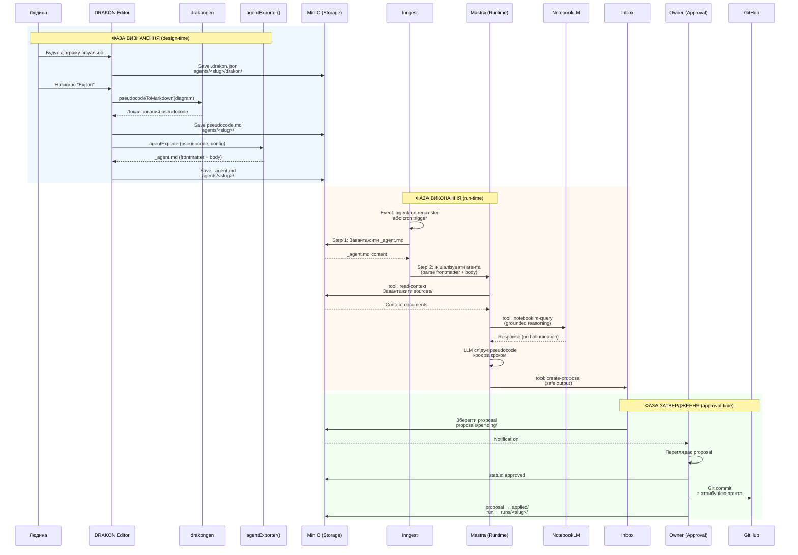
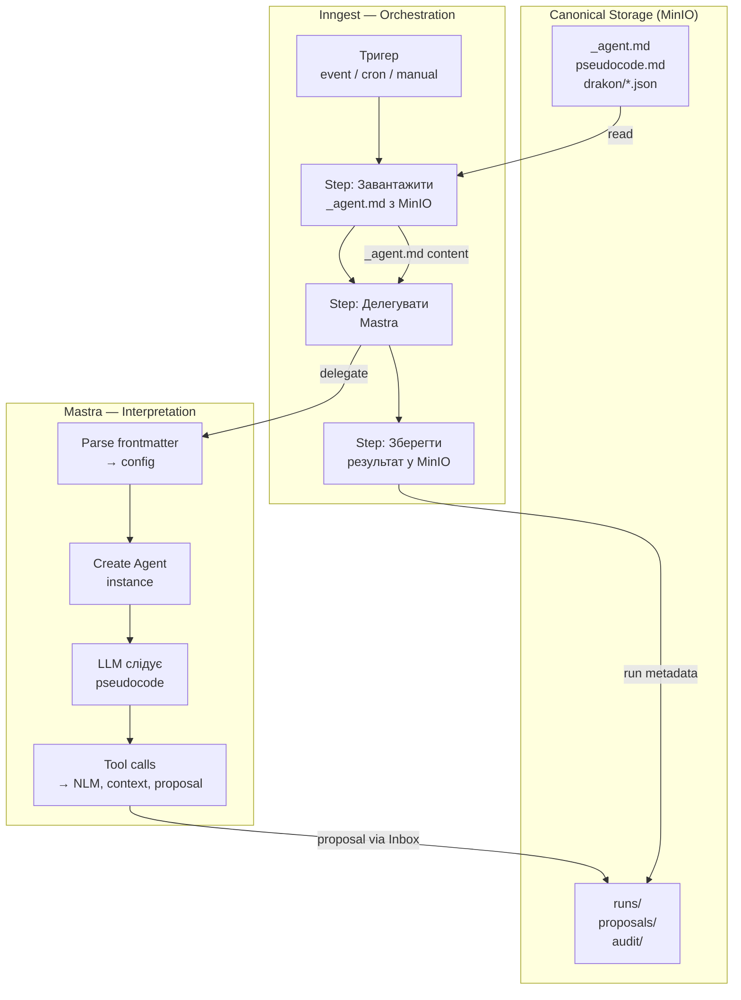

# DRAKON: інтеграція та модель виконання агента

> Створено: 2026-02-14
> Автор: Головний архітектор системи
> Базується на: MANIFESTO.md §6, КОНТРАКТ_АГЕНТА_V1.md, ЦІЛЬОВА_АРХІТЕКТУРА_MASTRA_INNGEST.md, INBOX_ТА_PROPOSAL_АРХІТЕКТУРА.md
> Статус: Архітектурна специфікація

---

## 1. Роль DRAKON у системі

### 1.1 DRAKON як канонічний інструмент визначення логіки

**[ПРИНЦИП]** DRAKON є канонічним інструментом визначення логіки агента у системі Garden Seedling.

DRAKON — візуальна алгоритмічна мова, що:
- усуває неоднозначність логіки (одна діаграма = одна інтерпретація)
- робить мислення візуальним (людина бачить повний потік)
- придатна для людини **і** машини одночасно

У контексті системи DRAKON виконує конкретну роль:

| Що DRAKON робить | Що DRAKON НЕ робить |
|-----------------|---------------------|
| Визначає послідовність дій агента | Не визначає конфігурацію агента (це frontmatter) |
| Визначає розгалуження та умови | Не визначає інструменти агента (це `tools[]`) |
| Визначає цикли та ітерації | Не визначає тригери запуску (це `triggers`) |
| Кодує бізнес-правила у візуальній формі | Не виконує логіку (це runtime) |

**[ПРИНЦИП]** DRAKON — це мова **специфікації**, не мова **виконання**. Діаграма описує *що* агент має робити. Runtime визначає *як* це виконати.

### 1.2 Ланцюг трансформацій

**[ІНВАРІАНТ]** Логіка агента проходить чотири фази трансформації. Кожна фаза має чітке призначення і не може бути пропущена для агентів, визначених через DRAKON.

```
┌─────────────────┐      ┌─────────────────┐      ┌─────────────────┐      ┌─────────────────┐
│  DRAKON         │      │  Pseudocode     │      │  _agent.md      │      │  Runtime        │
│  diagram        │─────►│                 │─────►│                 │─────►│  execution      │
│                 │      │                 │      │                 │      │                 │
│  .drakon.json   │      │  pseudocode.md  │      │  frontmatter +  │      │  Mastra Agent   │
│                 │      │                 │      │  instructions   │      │  instance       │
│  Візуальна      │      │  Текстовий      │      │  Повний         │      │  Інтерпретація  │
│  специфікація   │      │  контракт       │      │  контракт       │      │  контракту      │
│  логіки         │      │  поведінки      │      │  агента         │      │                 │
└─────────────────┘      └─────────────────┘      └─────────────────┘      └─────────────────┘
       │                        │                        │                        │
   Авторство:              Генерація:               Збірка:                Виконання:
   ЛЮДИНА                  drakongen                agentExporter()         Mastra
   (DRAKON Editor)         (автоматично)            (автоматично)          (per-run)
```

Опис фаз:

| Фаза | Артефакт | Хто створює | Формат | Призначення |
|------|----------|-------------|--------|-------------|
| **1. Специфікація** | `.drakon.json` | Людина через DRAKON Editor | JSON (DrakonWidget native) | Візуальне визначення логіки; авторитетне джерело |
| **2. Контракт поведінки** | `pseudocode.md` | `drakongen` (автоматично) | Локалізований псевдокод (Markdown) | Текстове представлення логіки; machine-readable contract |
| **3. Контракт агента** | `_agent.md` | `agentExporter()` (автоматично) | YAML frontmatter + Markdown body | Повний контракт: конфігурація + поведінка; вхідна точка для runtime |
| **4. Виконання** | Mastra Agent instance | Runtime (per-run) | In-memory object | Тимчасове представлення; існує лише під час run |

**[ІНВАРІАНТ]** Напрямок трансформації — **однонаправлений**: діаграма → псевдокод → агент → виконання. Зворотного шляху (runtime → діаграма) не існує. Якщо потрібно змінити поведінку — змінюється діаграма, і ланцюг проходить знову.

**[ПРИНЦИП]** Фаза 4 (виконання) є **ефемерною**. Вона не зберігається і не є джерелом істини. Джерелом істини є фази 1–3, які зберігаються у MinIO.

---

## 2. Канонічні місця зберігання

### 2.1 Файлова структура агента у MinIO

```
garden-agents/agents/<slug>/
│
├── drakon/                             ← ФАЗА 1: візуальна логіка
│   ├── main-flow.drakon.json           ← основний потік агента
│   ├── error-handling.drakon.json      ← обробка помилок (опціонально)
│   └── subroutine-X.drakon.json        ← підпроцедури (опціонально)
│
├── pseudocode.md                       ← ФАЗА 2: behavioral contract
│
├── _agent.md                           ← ФАЗА 3: повний контракт агента
│
├── sources/                            ← контекстні джерела
├── memory/                             ← накопичений досвід
├── runs/                               ← журнал виконань
└── artifacts/                          ← довготривалі результати
```

### 2.2 Роль кожного файлу

#### `drakon/*.drakon.json` — візуальна специфікація логіки

**[ПРИНЦИП]** Це **авторитетне джерело** логіки агента. Якщо існує розбіжність між діаграмою та будь-яким іншим артефактом (pseudocode, _agent.md, runtime поведінка) — діаграма має рація.

Характеристики:
- Формат: JSON, native для DrakonWidget (`exportJson()` / `setDiagram()`)
- Автор: виключно людина через DRAKON Editor у frontend
- Зміна: лише через DRAKON Editor → save → MinIO
- Може містити декілька файлів (main flow + підпроцедури)
- Не читається runtime напряму (runtime читає pseudocode)

#### `pseudocode.md` — декларативний behavioral contract

**[ПРИНЦИП]** Це **контракт поведінки**, що описує логіку агента у текстовій формі. Runtime інтерпретує цей контракт, а не діаграму.

Характеристики:
- Формат: Markdown з локалізованим псевдокодом
- Автор: `drakongen` / `pseudocodeToMarkdown()` (автоматична генерація з діаграми)
- Мова: українська (ключові слова: ПОЧАТОК, КІНЕЦЬ, ЯКЩО, ДЛЯ КОЖНОГО, тощо)
- Семантика: декларативна — описує *що* робити, не *як*
- Runtime читає цей файл для визначення послідовності дій

Приклад:

```markdown
ПОЧАТОК "Аналіз нотаток"

  нотатки ← read-notes(folder)

  ЯКЩО нотатки порожні
    write-memory("Нових нотаток немає")
    → КІНЕЦЬ

  ДЛЯ КОЖНОГО нотатка З нотатки
    ЯКЩО нотатка.має_тег("summarized")
      → НАСТУПНА

    зміст ← read-context(нотатка.slug)

    відповідь ← notebooklm-query("Створи резюме", зміст)

    create-proposal(
      тип: "propose-summary",
      нотатка: нотатка.slug,
      зміст: відповідь
    )

КІНЕЦЬ
```

**[ІНВАРІАНТ]** Pseudocode має бути **повним** — містити всю логіку без пропусків. Якщо діаграма має 10 кроків — pseudocode має мати 10 відповідних операцій. Часткова генерація заборонена.

#### `_agent.md` — повний контракт агента

**[ПРИНЦИП]** Це **єдина точка входу** для runtime. Runtime не читає діаграму та не генерує pseudocode. Він читає `_agent.md`, де pseudocode вже вбудований у Markdown body.

Характеристики:
- Формат: YAML frontmatter (конфігурація) + Markdown body (інструкції / pseudocode)
- Автор: `agentExporter()` (автоматична збірка з pseudocode + frontmatter template)
- Містить: ідентичність, модель, інструменти, safe outputs, тригери, контекст
- Поле `generated_from`: вказує на файл діаграми-джерела
- Runtime парсить frontmatter для конфігурації, body — для instructions

Зв'язок з pseudocode:

```
_agent.md =
  YAML frontmatter (конфігурація)
  +
  Markdown body (= pseudocode.md content, можливо з додатковим контекстом)
```

**[ІНВАРІАНТ]** Якщо `_agent.md` має поле `generated_from` — його Markdown body повинен відповідати вмісту `pseudocode.md`. Ручні зміни body без видалення `generated_from` — порушення контракту.

---

## 3. Модель інтерпретації логіки агента

### 3.1 Runtime як інтерпретатор

**[ІНВАРІАНТ]** Runtime НЕ має містити hardcoded logic агента.

Це фундаментальна межа між **визначенням** логіки та **виконанням** логіки:

| Аспект | Визначення (storage) | Виконання (runtime) |
|--------|---------------------|---------------------|
| Де знаходиться | MinIO: `_agent.md`, `pseudocode.md`, `drakon/` | Mastra: in-memory Agent instance |
| Хто автор | Людина (через DRAKON Editor) | Система (автоматично при run) |
| Тривалість | Персистентна (живе поки не видалена) | Ефемерна (живе тільки під час run) |
| Зміна поведінки | Зміна файлу у MinIO | Перечитування файлу при наступному run |
| Відповідальність | Визначає *що* робити | Визначає *як* виконати |

**[ПРИНЦИП]** Runtime є **інтерпретатором**, не **автором** логіки. Ця різниця є не семантичною, а архітектурною: runtime не має методу `createLogic()` чи `defineSteps()`. Він має лише `readContract()` → `interpretContract()` → `executeStep()`.

### 3.2 Pseudocode як декларативний behavioral contract

Pseudocode — це не програмний код, що виконується напряму. Це **декларативний контракт**, що описує бажану поведінку.

Відмінність від програмного коду:

| Характеристика | Програмний код | Pseudocode (behavioral contract) |
|---------------|---------------|--------------------------------|
| Виконується | Компілятором / інтерпретатором напряму | LLM інтерпретує як інструкції |
| Синтаксис | Строгий (parse error = failure) | Гнучкий (LLM розуміє варіації) |
| Семантика | Точна (одна інтерпретація) | Декларативна (опис наміру) |
| Мова | Англійська (code keywords) | Українська (локалізовані ключові слова) |
| Виклики функцій | Прямий виклик функції | Маппінг на tool calls через Mastra |

**[ПРИНЦИП]** Pseudocode описує **бажану поведінку**, а не послідовність машинних операцій. Рядок `відповідь ← notebooklm-query("Створи резюме", зміст)` означає: "використай інструмент notebooklm-query для отримання резюме". Mastra інтерпретує це як tool call до FastAPI.

### 3.3 Як runtime інтерпретує контракт

```
Крок 1: Runtime завантажує _agent.md з MinIO
        ↓
Крок 2: Парсить YAML frontmatter → конфігурація агента
        (model, tools, safe_outputs, max_steps, temperature)
        ↓
Крок 3: Читає Markdown body → instructions агента
        (включаючи pseudocode)
        ↓
Крок 4: Створює Mastra Agent instance:
        - instructions = Markdown body
        - model = frontmatter.model
        - tools = зареєстровані tools відповідно до frontmatter.tools[]
        ↓
Крок 5: LLM отримує instructions (з pseudocode) і виконує крок за кроком:
        - Кожен ЯКЩО → рішення LLM на основі даних
        - Кожен tool call (←) → Mastra виконує registered tool
        - Кожен create-proposal → запис через Inbox
        ↓
Крок 6: Результати записуються у MinIO (runs/, proposals/)
        Agent instance знищується
```

**[ПРИНЦИП]** LLM не "запускає код". Він **слідує інструкціям**, записаним у pseudocode, використовуючи доступні tools. Pseudocode — це system prompt з формалізованою структурою.

### 3.4 Що runtime НЕ має робити

**[ІНВАРІАНТ]** Заборонені патерни у runtime:

| Заборонений патерн | Чому заборонений | Правильний підхід |
|-------------------|-----------------|-------------------|
| Hardcoded if/else для конкретного агента | Логіка має бути у pseudocode | Додати умову у DRAKON-діаграму |
| Спеціальний код для `archivist-violin` | Агент-специфічний код = порушення абстракції | Описати у `_agent.md` цього агента |
| Default instructions у runtime | Runtime не знає, що агент "має" робити | Інструкції — виключно у `_agent.md` |
| Cached agent definitions | Runtime не кешує між runs | Завантажувати з MinIO при кожному run |
| Мутація `_agent.md` під час виконання | Runtime — read-only щодо контракту | Зміна контракту = нова версія через DRAKON |

---

## 4. Життєвий цикл виконання логіки

### 4.1 Повний lifecycle



### 4.2 Фази у деталях

#### Фаза визначення (design-time)

| Крок | Вхід | Дія | Вихід | Де зберігається |
|------|------|-----|-------|-----------------|
| D1 | Людська інтенція | Побудова діаграми у DRAKON Editor | `.drakon.json` | `agents/<slug>/drakon/` |
| D2 | `.drakon.json` | `pseudocodeToMarkdown()` | `pseudocode.md` | `agents/<slug>/` |
| D3 | `pseudocode.md` + config | `agentExporter()` | `_agent.md` | `agents/<slug>/` |

**[ПРИНЦИП]** Фаза визначення — людська. Автоматизація (drakongen, agentExporter) виконує **механічну** трансформацію, не **творчу**. Логіка створюється людиною.

#### Фаза виконання (run-time)

| Крок | Вхід | Дія | Вихід | Де зберігається |
|------|------|-----|-------|-----------------|
| R1 | Тригер (event/cron/manual) | Inngest створює run | `run_id` | Inngest state |
| R2 | `_agent.md` з MinIO | Parse frontmatter + body | Agent config + instructions | In-memory |
| R3 | instructions (pseudocode) | LLM інтерпретує кроки | Tool calls + reasoning | In-memory → `runs/<id>/steps/` |
| R4 | Reasoning result | `create-proposal` tool call | Proposal JSON | `proposals/pending/` |
| R5 | Run metadata | Run complete | `manifest.json` | `runs/<id>/` |

**[ПРИНЦИП]** Фаза виконання — **stateless** щодо агента. Кожен run починається з чистого стану, завантажуючи `_agent.md` з MinIO. Це забезпечує: зміна `_agent.md` → зміна поведінки при наступному run, без перезапуску сервісу.

#### Фаза затвердження (approval-time)

| Крок | Вхід | Дія | Вихід | Де зберігається |
|------|------|-----|-------|-----------------|
| A1 | Proposal | Owner переглядає | Рішення (approve/reject) | `proposals/approved/` або `rejected/` |
| A2 | Approved proposal | Apply engine | Git commit / MinIO write | GitHub + MinIO |
| A3 | Run + proposal metadata | Audit | Audit log entry | `audit/` |

---

## 5. Взаємодія з Mastra і Inngest

### 5.1 Mastra: інтерпретатор контракту

**[РІШЕННЯ]** Mastra читає `_agent.md` і перетворює його на працюючого агента. Mastra не знає і не повинен знати, що pseudocode було згенеровано з DRAKON.

Що Mastra робить:

| Операція | Вхід | Вихід |
|----------|------|-------|
| Parse frontmatter | YAML з `_agent.md` | Agent config (model, tools, safe_outputs) |
| Create Agent instance | Config + instructions | Mastra Agent object |
| Register tools | `tools[]` з frontmatter | Callable tool functions |
| Execute | Instructions (body) + tools | LLM response + tool call results |
| Return result | Structured output | Proposal JSON для Inbox |

Що Mastra НЕ робить:

**[ОБМЕЖЕННЯ]** Mastra не модифікує `_agent.md`, `pseudocode.md`, чи `.drakon.json`. Runtime — це **read-only consumer** canonical storage.

**[ОБМЕЖЕННЯ]** Mastra не зберігає стан агента між запусками. Кожен run = нове завантаження `_agent.md` з MinIO. Якщо `_agent.md` змінився між runs — поведінка агента змінюється автоматично.

**[ОБМЕЖЕННЯ]** Mastra не інтерпретує pseudocode як програмний код. Pseudocode потрапляє до LLM як частина system prompt (instructions). LLM слідує pseudocode як інструкціям, використовуючи зареєстровані tools.

### 5.2 Inngest: оркестратор lifecycle

**[РІШЕННЯ]** Inngest керує **коли** і **з якою надійністю** виконується агент. Він не знає про зміст `_agent.md` і не інтерпретує pseudocode.

Що Inngest робить:

| Операція | Механізм |
|----------|----------|
| Прийняти тригер | Event `agent/run.requested`, cron schedule |
| Створити run | Виділити `run_id`, зафіксувати початок |
| Завантажити контракт | Step: read `_agent.md` з MinIO |
| Делегувати виконання | Step: передати `_agent.md` у Mastra |
| Забезпечити durability | Retry при збоях, timeout per step |
| Зберегти результат | Step: write run log та proposal у MinIO |
| Завершити run | Emit event `agent/run.finished` |

Що Inngest НЕ робить:

**[ОБМЕЖЕННЯ]** Inngest не парсить frontmatter і не читає pseudocode. Для Inngest `_agent.md` — це opaque blob, який передається Mastra.

**[ОБМЕЖЕННЯ]** Inngest не приймає рішень про поведінку агента. Рішення про розгалуження, вибір tool, формулювання proposal — це відповідальність Mastra + LLM.

**[ОБМЕЖЕННЯ]** Durable state у Inngest — це **ефемерний** стан workflow. Після завершення run канонічний результат записується у MinIO. Inngest може втратити свій state без наслідків для системи.

### 5.3 Межі між Mastra і Inngest



### 5.4 Таблиця: хто що контролює

| Аспект | DRAKON | MinIO | Mastra | Inngest |
|--------|--------|-------|--------|---------|
| **Визначення логіки** | Авторитетне джерело | Зберігає | — | — |
| **Behavioral contract** | Генерує (через drakongen) | Зберігає | Читає | — |
| **Конфігурація агента** | — | Зберігає | Парсить і застосовує | — |
| **Коли запускати** | — | — | — | Визначає і виконує |
| **Як виконувати** | — | — | Визначає і виконує | — |
| **Retry та durability** | — | — | — | Визначає і виконує |
| **Результати виконання** | — | Зберігає (canonical) | Генерує | Транспортує |
| **Зміна поведінки** | Змінити діаграму | Зберегти новий файл | Перечитати при наступному run | Не потрібна дія |

---

## 6. Інваріанти, які не можна порушувати

Нижче — повний перелік архітектурних інваріантів, що стосуються DRAKON, pseudocode, та моделі виконання агента. Порушення будь-якого з них означає архітектурний дефект.

---

**[ІНВАРІАНТ 1]** DRAKON-діаграма є авторитетним джерелом логіки агента.

Якщо існує розбіжність між діаграмою та pseudocode — pseudocode має бути перегенерований з діаграми. Якщо існує розбіжність між діаграмою та runtime поведінкою — runtime поведінка помилкова.

---

**[ІНВАРІАНТ 2]** Pseudocode є декларативним behavioral contract.

Pseudocode описує *бажану поведінку*, а не послідовність машинних операцій. Він інтерпретується LLM як instructions, а не виконується як програмний код.

---

**[ІНВАРІАНТ 3]** Storage (MinIO) є єдиним source of truth.

Усі артефакти визначення агента (`_agent.md`, `pseudocode.md`, `.drakon.json`) зберігаються у MinIO. Runtime (Mastra) і orchestrator (Inngest) не є джерелами істини. При втраті їхнього стану — система відновлюється з MinIO без втрат.

---

**[ІНВАРІАНТ 4]** Runtime є інтерпретатором, не автором логіки.

Runtime (Mastra) читає контракт і виконує його. Він не містить hardcoded logic жодного агента. Додавання нового агента = додавання файлу `_agent.md` у MinIO, без зміни коду runtime.

---

**[ІНВАРІАНТ 5]** Ланцюг трансформацій однонаправлений.

Діаграма → pseudocode → `_agent.md` → runtime execution. Зворотна трансформація (runtime → діаграма) не існує. Зміна поведінки починається з діаграми.

---

**[ІНВАРІАНТ 6]** Кожен run — stateless щодо попередніх runs.

Runtime завантажує `_agent.md` з MinIO при кожному запуску. Він не кешує визначення між запусками. Зміна `_agent.md` = зміна поведінки при наступному run, без перезапуску сервісу.

---

**[ІНВАРІАНТ 7]** Агент може впливати на систему лише через proposal.

Результат виконання pseudocode — це proposal, що проходить через Inbox → Approval Gate → Apply. Агент не має прямого запису в canonical storage.

---

**[ІНВАРІАНТ 8]** Pseudocode має бути повним і відповідати діаграмі.

Якщо `_agent.md` має поле `generated_from` — Markdown body повинен відповідати вмісту `pseudocode.md`, який повинен відповідати логіці діаграми. Часткова генерація заборонена.

---

*Цей документ є архітектурною специфікацією, не планом реалізації. Він визначає контракти і інваріанти, яким повинна відповідати будь-яка реалізація системи виконання агентів.*
