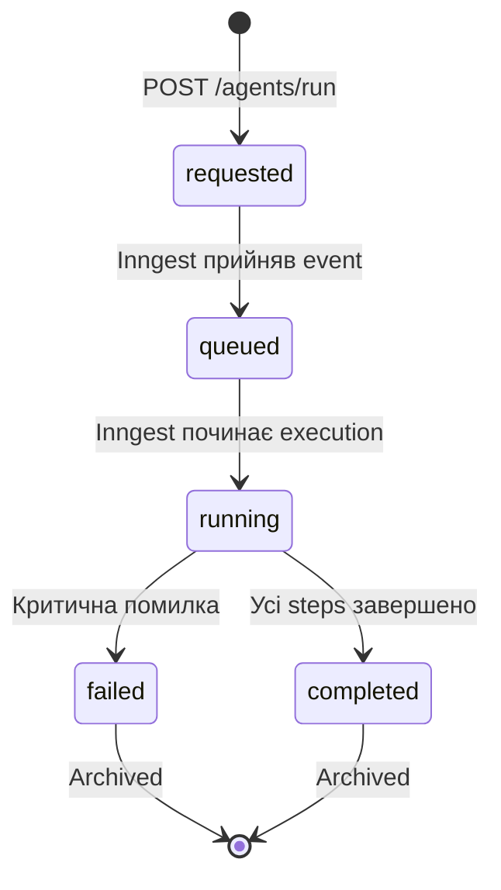

# Inbox та Run: Lifecycle V1

> Створено: 2026-02-15
> Автор: Головний архітектор системи
> Джерело деталей: INBOX_ТА_PROPOSAL_АРХІТЕКТУРА.md
> Статус: Специфікація для Lovable frontend
> Мова: Українська (канонічна)

---

## 0. Призначення

Цей документ є **витягом** з INBOX_ТА_PROPOSAL_АРХІТЕКТУРА.md, оптимізованим для Lovable frontend імплементації. Він описує:

- State machines для Inbox та Run
- Поля, які UI читає та відображає
- Endpoints, які UI викликає
- Transitions, на які UI реагує

Для повних деталей (consent gates, auto-approve engine, webhook registration) — див. INBOX_ТА_PROPOSAL_АРХІТЕКТУРА.md.

---

## 1. Inbox Entry: State Machine

### 1.1 Стани

```
[створено] → pending → processed | rejected | expired
```

| Стан | Значення | UI-відображення |
|------|---------|-----------------|
| **pending** | Entry прийнято, чекає обробки | Жовтий badge, показати у списку |
| **processed** | Перетворено на Proposal | Зелений badge, лінк на proposal |
| **rejected** | Відхилено Validation Gate | Червоний badge, показати причину |
| **expired** | TTL вичерпано (default: 72h) | Сірий badge, приховати або фільтр |

### 1.2 Transitions

| Перехід | Хто | Тригер | UI-реакція |
|---------|-----|--------|------------|
| `→ pending` | Worker | POST /inbox/submit | Toast: "Прийнято до обробки" |
| `pending → processed` | Worker | Validation Gate пройдено | Badge зміна, показати proposalId |
| `pending → rejected` | Worker | Validation Gate не пройдено | Badge зміна, показати reason |
| `pending → expired` | System (cron) | TTL вичерпано | Badge зміна або приховати |

### 1.3 Inbox Entry: поля для UI

```typescript
interface InboxEntry {
  id: string;                    // "inbox_2026-02-14_abc123"
  source: {
    type: "ui" | "telegram" | "webhook" | "agent" | "cron";
    identity: string;            // "owner" | "guest:zone_abc" | "agent:archivist-violin"
  };
  intent: {
    action: string;              // "propose-edit" | "propose-summary" | ...
    target: string;              // "notes/violin.pp.ua/sonata-bwv1001"
  };
  metadata: {
    correlation_id?: string;
    priority: "normal" | "high";
    ttl_hours: number;           // default: 72
  };
  status: "pending" | "processed" | "rejected" | "expired";
  created_at: string;            // ISO 8601
  proposal_id?: string;          // заповнюється коли status = processed
  rejection_reason?: string;     // заповнюється коли status = rejected
}
```

### 1.4 Inbox Expiry UX

**[РІШЕННЯ]** Expired entries:

- **Поведінка:** entry зі статусом `expired` **не видаляється**. Він переміщується до `inbox/expired/` у MinIO.
- **UI:** За замовчуванням expired entries **приховані** з основного списку. Доступні через фільтр "Показати прострочені".
- **Badge:** Сірий badge з іконкою годинника + текст "Прострочено".
- **Дія:** Owner може вручну повторно створити entry через Quick Add.

---

## 2. Agent Run: State Machine

### 2.1 Стани

```
[ініційовано] → requested → queued → running → completed | failed
```



### 2.2 Опис станів

| Стан | Значення | Хто встановлює | UI-відображення |
|------|---------|----------------|-----------------|
| **requested** | Worker отримав запит, ще не надіслав Inngest event | Worker | Spinner: "Надсилається..." |
| **queued** | Inngest прийняв event, run чекає у черзі (concurrency limit) | Inngest (через Worker callback) | Badge: "У черзі", позиція у черзі (якщо відома) |
| **running** | Mastra активно виконує steps | Inngest/Mastra (через status.json) | Progress bar, step list з поточним highlighted |
| **completed** | Усі steps завершено, proposal(и) створено | Inngest (через status.json) | Зелений badge, лінк на proposal(и) |
| **failed** | Критична помилка (NLM недоступний, MinIO fail, timeout) | Inngest (через status.json) | Червоний badge, деталі помилки |

### 2.3 Transitions

| Перехід | Тригер | UI-реакція |
|---------|--------|------------|
| `→ requested` | Owner натискає "Run" | Redirect до Run Timeline, spinner |
| `requested → queued` | Inngest acknowledge | Badge: "У черзі" |
| `queued → running` | Concurrency slot вільний | Progress bar з'являється |
| `running → running` (step update) | Mastra завершує крок | Крок у списку помічається ✓ |
| `running → completed` | Останній step завершено | Зелений badge, notification |
| `running → failed` | Помилка | Червоний badge, error details |

### 2.4 Run Status: поля для UI

```typescript
interface RunStatus {
  run_id: string;                // "run_2026-02-14_080000_abc123"
  agent_slug: string;
  status: "requested" | "queued" | "running" | "completed" | "failed";
  trigger: "manual" | "cron" | "event";

  started_at: string;            // ISO 8601
  finished_at?: string;          // ISO 8601, null якщо ще виконується

  current_step?: string;         // назва поточного кроку
  steps_total?: number;          // загальна кількість кроків (estimated)
  steps_completed: number;       // скільки завершено

  proposals_created: string[];   // масив proposal IDs
  error?: string;                // деталі помилки, null якщо OK
}
```

### 2.5 Run Step: поля для UI

```typescript
interface RunStep {
  step_number: number;           // 1, 2, 3...
  step_name: string;             // "load-context", "nlm-query", "create-proposal"
  status: "pending" | "running" | "completed" | "failed" | "skipped";
  started_at?: string;
  finished_at?: string;
  duration_ms?: number;
  output_summary?: string;       // короткий опис результату (для UI)
  error?: string;
}
```

### 2.6 Status Writer

**[ІНВАРІАНТ]** Canonical writer для `runs/<runId>/status.json` — це **оркестраційний шар** (Inngest/backend).

Mastra **НЕ** пише `status.json` напряму. Потік:

```
Mastra виконує step → повертає результат Inngest
→ Inngest step function записує step result у MinIO
→ Inngest оновлює status.json (статус, current_step, steps_completed)
→ UI polling читає status.json через Worker
```

Це забезпечує:
- Єдиний writer для status (no race conditions)
- Mastra залишається stateless інтерпретатором
- Inngest контролює retry/timeout/concurrency

---

## 3. Notification Transport

### 3.1 MVP: Polling

**[РІШЕННЯ]** MVP використовує **polling** для оновлень:

| Що | Endpoint | Інтервал | Коли зупинити |
|----|----------|----------|---------------|
| Active run status | `GET /runs/{runId}/status` | 5 секунд | `status ∈ {completed, failed}` |
| Inbox updates | `GET /inbox/stats` | 30 секунд | Сторінка закрита |
| Pending proposals | `GET /proposals/pending` | 30 секунд | Сторінка закрита |

### 3.2 Майбутнє: SSE (опціонально)

**[РІШЕННЯ]** Опціонально у пост-MVP:

```
GET /events/stream
Accept: text/event-stream

data: {"type": "run.step.completed", "runId": "...", "step": 3}
data: {"type": "proposal.created", "proposalId": "..."}
data: {"type": "inbox.new", "count": 5}
```

SSE замінить polling для real-time updates. Frontend має підтримувати graceful fallback до polling якщо SSE недоступний.

---

## 4. Endpoints для UI

| Method | Endpoint | Auth | Повертає |
|--------|----------|------|---------|
| `POST` | `/inbox/submit` | Owner / Zone Guest | `{inbox_id, status}` |
| `GET` | `/inbox/stats` | Owner | `{pending, processed, rejected}` counts |
| `GET` | `/inbox/entries?status=pending` | Owner | `InboxEntry[]` |
| `POST` | `/agents/run` | Owner | `{run_id}` |
| `GET` | `/runs/{runId}/status` | Owner | `RunStatus` |
| `GET` | `/runs/{runId}/steps` | Owner | `RunStep[]` |
| `GET` | `/runs?agent={slug}` | Owner | `RunStatus[]` (історія) |

Деталі request/response schemas — див. API_CONTRACTS_V1.md.

---

## Див. також

- **INBOX_ТА_PROPOSAL_АРХІТЕКТУРА.md** — повна специфікація Inbox, Proposal lifecycle, Consent Gates, Auto-approve engine
- **PROPOSAL_SYSTEM_V1.md** — state machine та UI-контракт для Proposals
- **API_CONTRACTS_V1.md** — повні JSON schemas для всіх endpoints
- **LOVABLE_УЗГОДЖЕННЯ_З_RUNTIME_АРХІТЕКТУРОЮ.md** — контракт frontend з runtime

---

*Цей документ є канонічним витягом lifecycle для frontend імплементації.*
