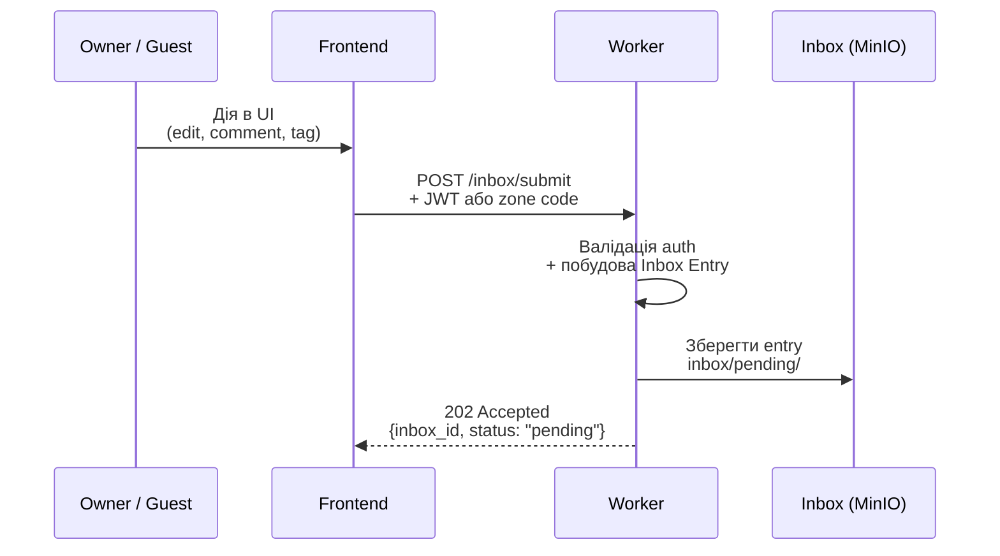
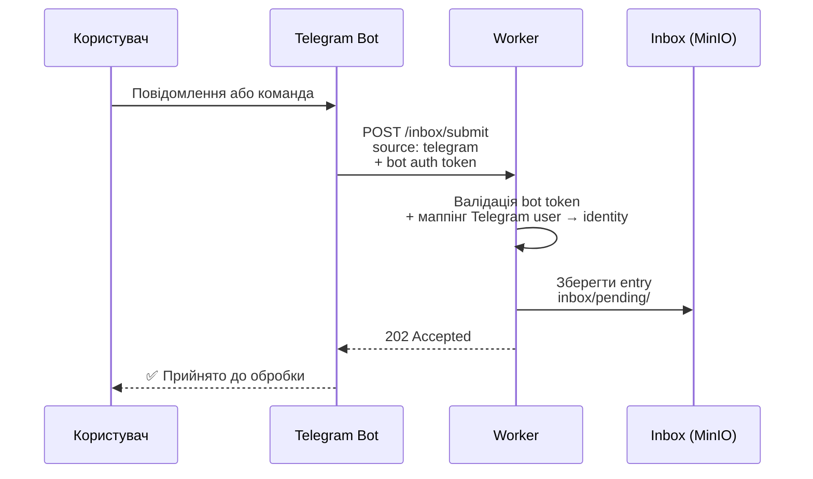
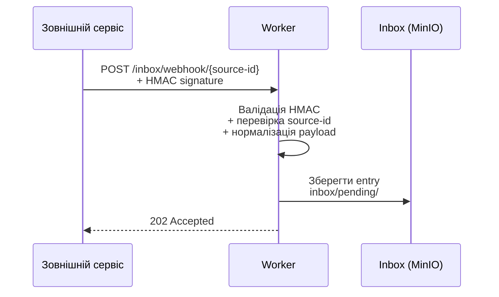
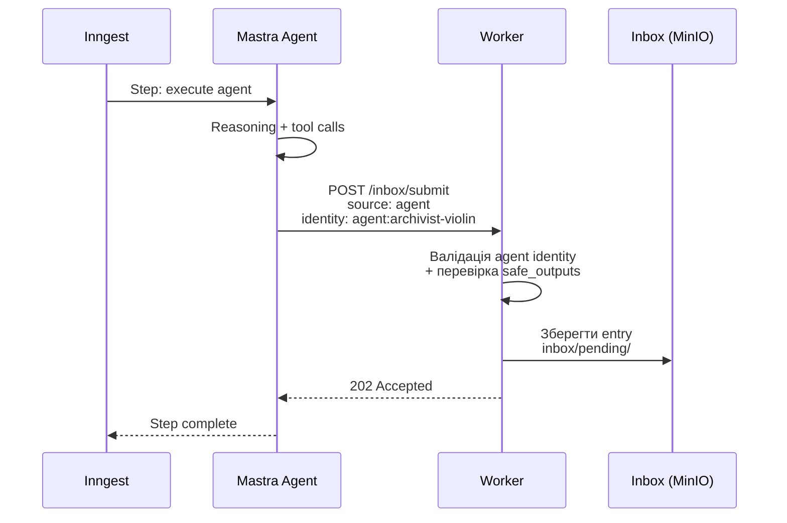
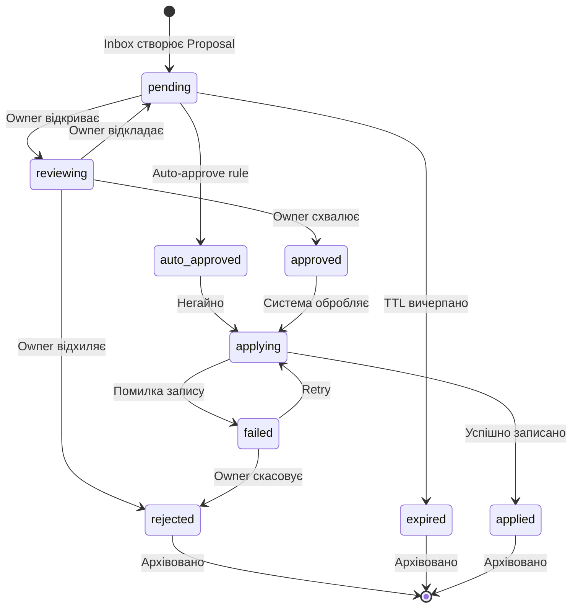
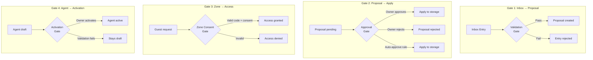
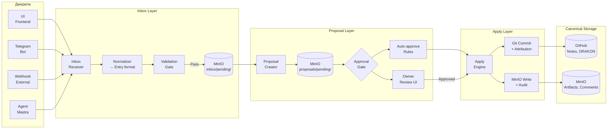
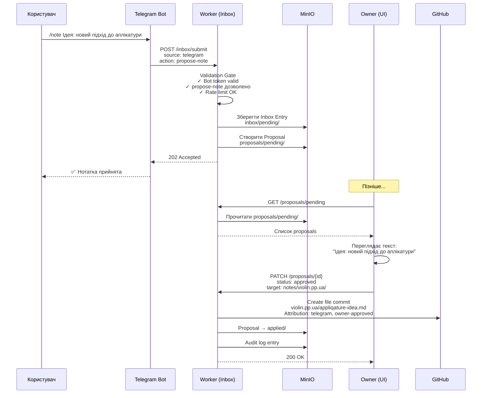
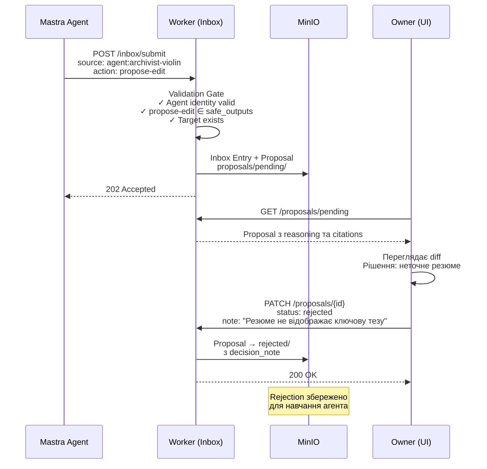

# Inbox та Proposal: архітектура

> Створено: 2026-02-14
> Автор: Архітектор системи
> Базується на: КОНТРАКТ_АГЕНТА_V1.md, ЦІЛЬОВА_АРХІТЕКТУРА_MASTRA_INNGEST.md, АРХІТЕКТУРНА_БАЗА_СИСТЕМИ.md, MANIFESTO.md
> Статус: Специфікація

---

## 0. Фундаментальний інваріант

**[ПРИНЦИП]** Proposal є єдиним дозволеним механізмом змін canonical storage.

Жодна сутність у системі — людина, агент, зовнішній сервіс — не може змінити канонічні дані (MinIO, Git) напряму. Будь-яка зміна проходить через:

```
Намір → Proposal → Consent Gate → Apply → Canonical Storage
```

Це не бюрократія. Це **структурний захист цілісності знань**.

Наслідки:

- Агент (Mastra) не має прямого запису у MinIO чи Git. Він створює proposal.
- Гість (Zone Guest) не може редагувати нотатку. Він створює proposal.
- Telegram-бот не може додати замітку. Він створює proposal.
- Webhook не може модифікувати артефакт. Він створює proposal.
- Навіть Owner працює через apply — різниця в тому, що Owner **може** бути auto-approver для власних proposals.

**[ПРИНЦИП]** Proposal — це іммутабельний артефакт. Після створення він не змінюється. Змінюється лише його статус (pending → approved/rejected → applied/discarded).

---

## 1. Inbox як канонічна точка входу

### 1.1 Що таке Inbox

Inbox — це **єдина канонічна точка прийому намірів** у систему. Будь-який зовнішній або внутрішній сигнал, що має на меті змінити стан системи, потрапляє спочатку в Inbox.

**[РІШЕННЯ]** Inbox — це не UI-компонент. Це **архітектурний шар** між зовнішнім світом та proposal lifecycle. Inbox:

- приймає намір з будь-якого джерела
- нормалізує його до єдиного формату (Inbox Entry)
- валідує джерело (автентифікація, авторизація)
- створює Proposal або відхиляє з поясненням

### 1.2 Inbox Entry — канонічний формат

Будь-який намір, незалежно від джерела, нормалізується до:

```json
{
  "id": "inbox_2026-02-14_abc123",
  "source": {
    "type": "ui | telegram | webhook | agent | cron",
    "identity": "owner | guest:zone_abc | agent:archivist-violin | bot:telegram",
    "authenticated": true,
    "timestamp": "2026-02-14T12:00:00Z"
  },
  "intent": {
    "action": "propose-edit | propose-summary | propose-tag | propose-artifact | propose-note | propose-comment",
    "target": "notes/violin.pp.ua/sonata-bwv1001",
    "payload": { }
  },
  "metadata": {
    "correlation_id": "run_2026-02-14_080000_abc123",
    "priority": "normal | high",
    "ttl_hours": 72
  }
}
```

**[ПРИНЦИП]** Inbox Entry не містить самих змін. Він містить **намір** та **payload для proposal**. Зміни формалізуються у Proposal після проходження валідації.

### 1.3 Зберігання

**[РІШЕННЯ]** Inbox entries зберігаються у MinIO:

```
garden-agents/
└── inbox/
    ├── pending/                    ← нові, необроблені
    │   ├── inbox_2026-02-14_abc123.json
    │   └── inbox_2026-02-14_def456.json
    ├── processed/                  ← перетворені на proposals
    │   └── 2026-02/
    │       └── inbox_2026-02-14_abc123.json
    └── rejected/                   ← відхилені при валідації
        └── 2026-02/
            └── inbox_2026-02-14_ghi789.json
```

**[ОБМЕЖЕННЯ]** Inbox — це buffer, не довготривале сховище. Entries переміщуються до `processed/` або `rejected/` після обробки. TTL за замовчуванням — 72 години для необроблених entries.

---

## 2. Джерела Inbox

### 2.1 UI (Lovable Frontend)

**[РІШЕННЯ]** Frontend залишається головним джерелом намірів від людини.



| Дія в UI | Intent action | Хто може |
|----------|--------------|----------|
| Редагування нотатки | `propose-edit` | Owner, Zone Guest |
| Новий коментар | `propose-comment` | Owner, Zone Guest |
| Додавання тегу | `propose-tag` | Owner |
| Створення нотатки | `propose-note` | Owner |
| Запуск агента (результат) | `propose-artifact` | Owner (через agent run) |

**[РІШЕННЯ]** Для Owner з ввімкненим auto-approve: entry проходить через Inbox → Proposal → Auto-approve → Apply **в одному request cycle**. Але proposal все одно створюється і записується. Немає shortcut, що минає proposal.

### 2.2 Telegram

**[РІШЕННЯ]** Telegram-бот є зовнішнім джерелом Inbox, що дозволяє швидкий ввід з мобільного пристрою.



Типи Telegram-взаємодій:

| Команда / формат | Intent action | Приклад |
|-----------------|--------------|---------|
| `/note <текст>` | `propose-note` | `/note Нова ідея щодо сонати BWV 1001` |
| `/tag <slug> <tags>` | `propose-tag` | `/tag sonata-bwv1001 baroque, bach` |
| Пересланий текст | `propose-note` | Forwarded article → note proposal |
| Голосове повідомлення | `propose-note` | Транскрипція → note proposal |
| `/status` | (read-only, не Inbox) | Не створює proposal |

**[ОБМЕЖЕННЯ]** Telegram-бот не має Owner-рівня прав. Усі proposals від Telegram мають `source.identity: "bot:telegram"` і проходять повний approval cycle. Навіть якщо повідомлення надіслано Owner — ідентифікація відбувається через Telegram user mapping, не через JWT.

**[ОБМЕЖЕННЯ]** Telegram-бот може лише **створювати** proposals. Він не може **затверджувати** їх. Затвердження — виключно через UI або окремий захищений канал.

### 2.3 Webhooks

**[РІШЕННЯ]** Система приймає webhooks від зовнішніх сервісів як джерело Inbox.



| Джерело webhook | Intent action | Опис |
|----------------|--------------|------|
| GitHub (push event) | `propose-note` (sync) | Нова нотатка в Obsidian → sync до garden |
| Obsidian Sync | `propose-edit` | Зміна нотатки в Obsidian |
| External API | `propose-artifact` | Результат зовнішнього аналізу |
| Inngest callback | `propose-artifact` | Результат agent run |

**[ОБМЕЖЕННЯ]** Кожен webhook source має бути **зареєстрований** у системі з:
- `source-id` — унікальний ідентифікатор
- `hmac_secret` — для валідації підпису
- `allowed_actions[]` — які intent actions дозволені
- `auto_approve` — чи дозволений auto-approve (за замовчуванням: ні)

Конфігурація webhook sources зберігається у Cloudflare KV (`webhook_sources:{source-id}`).

### 2.4 Агенти (Mastra через Inngest)

**[РІШЕННЯ]** Результат виконання агента потрапляє в Inbox як proposal, а не записується напряму.



**[ПРИНЦИП]** Агент не знає, що він працює через Inbox. Mastra tool `create-proposal` внутрішньо робить `POST /inbox/submit`. Для агента це виглядає як один виклик інструменту.

**[ОБМЕЖЕННЯ]** Агент може створювати proposals лише тих типів, що перелічені в `safe_outputs[]` його `_agent.md`. Worker валідує це при прийомі в Inbox.

---

## 3. Lifecycle Proposal

### 3.1 Стани Proposal



### 3.2 Опис станів

| Стан | Значення | Хто переводить | Наступні стани |
|------|---------|----------------|----------------|
| **pending** | Proposal створено, очікує уваги | Inbox | `reviewing`, `auto_approved`, `expired` |
| **reviewing** | Owner переглядає proposal (UI-only стан, не серверний — див. PROPOSAL_SYSTEM_V1.md §1.3) | Owner (відкриття в UI) | `approved`, `rejected`, `pending` |
| **auto_approved** | Автоматично схвалено правилом | Система (rule engine) | `applying` |
| **approved** | Owner явно схвалив | Owner | `applying` |
| **applying** | Зміна записується в canonical storage | Система | `applied`, `failed` |
| **applied** | Зміна успішно записана | Система | Архів |
| **rejected** | Owner відхилив | Owner | Архів |
| **expired** | TTL вичерпано без дії | Система (cron) | Архів |
| **failed** | Помилка при записі | Система | `applying` (retry), `rejected` |

### 3.3 Структура Proposal

```json
{
  "id": "prop_2026-02-14_xyz789",
  "inbox_entry_id": "inbox_2026-02-14_abc123",
  "status": "pending",
  "created_at": "2026-02-14T12:00:05Z",
  "updated_at": "2026-02-14T12:00:05Z",
  "expires_at": "2026-02-17T12:00:05Z",

  "source": {
    "type": "agent",
    "identity": "agent:archivist-violin",
    "run_id": "run_2026-02-14_080000_abc123"
  },

  "action": "propose-edit",
  "target": {
    "type": "note",
    "path": "notes/violin.pp.ua/sonata-bwv1001.md"
  },

  "content": {
    "summary": "Додати структуроване резюме нотатки",
    "diff": {
      "type": "append",
      "position": "after-frontmatter",
      "text": "## Резюме\n\nСоната BWV 1001..."
    },
    "reasoning": "Нотатка не має резюме. NotebookLM підтвердив ключові тези.",
    "citations": [
      {"source": "violin-taxonomy.md", "quote": "BWV 1001 — перша соната..."}
    ]
  },

  "approval": {
    "decided_by": null,
    "decided_at": null,
    "decision_note": null
  },

  "apply_result": {
    "git_commit": null,
    "minio_path": null,
    "error": null
  }
}
```

### 3.4 Зберігання Proposals

```
garden-agents/
└── proposals/
    ├── pending/
    │   └── prop_2026-02-14_xyz789.json
    ├── approved/
    │   └── 2026-02/
    │       └── prop_2026-02-14_abc456.json
    ├── rejected/
    │   └── 2026-02/
    │       └── prop_2026-02-14_def789.json
    └── applied/
        └── 2026-02/
            └── prop_2026-02-14_abc456.json
```

**[РІШЕННЯ]** Proposals переміщуються між директоріями при зміні статусу. `pending/` — активна черга. Інші — архів за місяцями.

### 3.5 Apply — запис у canonical storage

| Тип дії | Canonical target | Механізм запису |
|---------|-----------------|-----------------|
| `propose-edit` | GitHub (note .md) | Worker → GitHub API commit з атрибуцією |
| `propose-note` | GitHub (new .md) | Worker → GitHub API create file |
| `propose-tag` | GitHub (note frontmatter) | Worker → GitHub API commit (frontmatter update) |
| `propose-summary` | MinIO (artifact) | Worker → MinIO S3 PUT |
| `propose-artifact` | MinIO (artifact) | Worker → MinIO S3 PUT |
| `propose-comment` | MinIO (comment) | Worker → MinIO S3 PUT + KV index update |

**[ПРИНЦИП]** Apply записує зміну в canonical storage **з атрибуцією**:

```
Git commit message:
  "[archivist-violin] Додати резюме sonata-bwv1001

  Proposal: prop_2026-02-14_xyz789
  Approved by: owner
  Agent: archivist-violin v1.2.0
  Run: run_2026-02-14_080000_abc123"
```

**[ПРИНЦИП]** Apply — це атомарна операція. Якщо запис не вдався — proposal переходить у `failed`, не у `applied`. Часткові записи заборонені.

---

## 4. Consent Gates

### 4.1 Що таке Consent Gate

Consent Gate — це **точка явної згоди** між двома фазами системи. Gate вимагає підтвердження від уповноваженої сутності перед тим, як дозволити перехід.

**[ПРИНЦИП]** Consent Gate — не UI-елемент. Це архітектурний патерн. UI-елемент (кнопка "Approve", чекбокс, діалог) — лише один з можливих інтерфейсів до gate.

### 4.2 Типи Consent Gates



### 4.3 Gate 1: Validation Gate (Inbox → Proposal)

Автоматичний gate. Перевіряє, чи entry має право створити proposal.

| Перевірка | Опис | Наслідок при відмові |
|-----------|------|---------------------|
| Автентифікація | Чи джерело ідентифіковане (JWT, bot token, HMAC, agent identity) | Entry → `rejected/` |
| Авторизація | Чи джерело має право на цей `intent.action` | Entry → `rejected/` |
| Safe outputs (для агентів) | Чи `intent.action` є в `safe_outputs[]` агента | Entry → `rejected/` |
| Target exists | Чи target (нотатка, папка) існує | Entry → `rejected/` |
| Duplicate check | Чи немає ідентичного pending proposal | Entry → `rejected/` (idempotency) |
| Rate limit | Чи не перевищено ліміт proposals від цього джерела | Entry → `rejected/` |

**[РІШЕННЯ]** Validation Gate повністю автоматичний. Людина не бере участі. Це фільтр на вході, не рішення.

### 4.4 Gate 2: Approval Gate (Proposal → Apply)

Головний consent gate системи. Тут людина вирішує.

| Режим | Хто вирішує | Коли |
|-------|------------|------|
| **Manual approval** | Owner через UI | За замовчуванням для всіх proposals |
| **Auto-approve** | Правило у системі | Для довірених джерел з ввімкненим auto-approve |
| **Batch approval** | Owner через UI | Масове схвалення/відхилення |

**[РІШЕННЯ]** Auto-approve правила:

| Правило | Умова | Обґрунтування |
|---------|-------|---------------|
| Owner self-proposals | `source.identity == "owner"` | Owner довіряє собі |
| Trusted agent, low-risk | `source.type == "agent"` AND `action IN ["propose-tag"]` | Теги — низькоризикова дія |
| Obsidian sync | `source.type == "webhook"` AND `source-id == "obsidian-sync"` | Авторитетне джерело нотаток |

**[ПРИНЦИП]** Auto-approve **не означає** відсутність proposal. Proposal все одно створюється, записується, і може бути переглянутий у аудит-лозі. Auto-approve = автоматичний перехід `pending → auto_approved → applying → applied`.

**[ОБМЕЖЕННЯ]** Auto-approve для агентів вимикається за замовчуванням. Owner має явно ввімкнути його для конкретного агента та конкретного типу дій.

### 4.5 Gate 3: Zone Consent Gate (Guest → Access)

Існуючий gate для доступу гостей до зон.

| Крок | Що відбувається |
|------|----------------|
| 1 | Гість вводить код зони (`ZONE-XXXX-YYYY`) |
| 2 | Worker валідує код, TTL, дозволені дії |
| 3 | Frontend показує GDPR-подібний consent screen |
| 4 | Гість погоджується з умовами (checkbox + підтвердження) |
| 5 | localStorage зберігає consent (policy versioning) |
| 6 | Гість отримує доступ до нотаток зони |

**[ПРИНЦИП]** Zone Consent Gate — це двоетапний gate: **технічний** (код зони) + **юридичний** (consent). Обидва обов'язкові.

### 4.6 Gate 4: Agent Activation Gate

Gate для переходу агента зі стану `draft` у `active` (визначений у КОНТРАКТ_АГЕНТА_V1.md).

| Перевірка | Критерій |
|-----------|----------|
| `_agent.md` валідний | Frontmatter парситься, обов'язкові поля присутні |
| `tools[]` не порожній | Хоча б один інструмент |
| `safe_outputs[]` не порожній | Хоча б один safe output |
| `model` валідний | Model ID розпізнається runtime |
| Owner consent | Owner явно натискає "Activate" |

**[ПРИНЦИП]** Автоматична активація агентів заборонена. Навіть якщо `_agent.md` валідний — потрібна явна дія Owner.

---

## 5. Наскрізна діаграма

### 5.1 Повний lifecycle: від наміру до canonical storage



### 5.2 Потік конкретного сценарію: Telegram → нотатка



### 5.3 Потік конкретного сценарію: Agent → proposal → rejection



---

## 6. API Surface

**[РІШЕННЯ]** Нові Worker endpoints для Inbox та Proposal lifecycle:

| Method | Endpoint | Auth | Опис |
|--------|----------|------|------|
| `POST` | `/inbox/submit` | Mixed | Створити Inbox Entry (UI, Telegram, Agent) |
| `POST` | `/inbox/webhook/{source-id}` | HMAC | Прийняти webhook |
| `GET` | `/proposals/pending` | Owner | Список pending proposals |
| `GET` | `/proposals/:id` | Owner | Деталі proposal |
| `PATCH` | `/proposals/:id` | Owner | Змінити статус (approve/reject) |
| `POST` | `/proposals/:id/apply` | Owner | Примусово apply (якщо auto не спрацював) |
| `GET` | `/proposals/history` | Owner | Архів applied/rejected proposals |
| `GET` | `/inbox/stats` | Owner | Статистика: pending, processed, rejected |

---

## 7. Auto-Approve Engine

**[РІШЕННЯ]** Auto-approve правила зберігаються у Cloudflare KV:

```json
{
  "key": "auto_approve_rules",
  "value": {
    "rules": [
      {
        "id": "owner-self",
        "condition": { "source.identity": "owner" },
        "enabled": true,
        "description": "Owner proposals auto-approved"
      },
      {
        "id": "obsidian-sync",
        "condition": {
          "source.type": "webhook",
          "source.identity": "webhook:obsidian-sync"
        },
        "enabled": true,
        "description": "Obsidian sync auto-approved"
      },
      {
        "id": "agent-tags",
        "condition": {
          "source.type": "agent",
          "action": "propose-tag"
        },
        "enabled": false,
        "description": "Agent tag proposals (disabled by default)"
      }
    ]
  }
}
```

**[ОБМЕЖЕННЯ]** Auto-approve engine оцінює правила **в порядку** їх визначення. Перше правило, що збіглося — визначає рішення. Якщо жодне правило не збіглося — proposal залишається `pending` для manual review.

**[ПРИНЦИП]** Auto-approve правила може змінювати лише Owner через UI. Агенти не можуть модифікувати auto-approve правила. Це запобігає ескалації привілеїв.

---

## 8. Відношення до існуючих компонентів

### 8.1 Сумісність з поточною системою

| Поточний компонент | Як змінюється |
|-------------------|---------------|
| Edit proposals (Worker, KV) | Мігрує до Inbox → Proposal flow; KV → MinIO |
| Zone Consent Gate | Без змін; залишається окремим gate для доступу |
| NotebookLM chat | Без змін; не проходить через Inbox (read-only) |
| DRAKON save | Без змін при ручному збереженні Owner; агентні зміни — через Inbox |
| Note editor commit | Стає Inbox entry з auto-approve для Owner |

### 8.2 Міграційний шлях

```
Фаза 1: Inbox + Proposal API у Worker
         Proposals у MinIO замість KV
         Існуючий edit proposal → нова система

Фаза 2: Telegram bot → Inbox інтеграція
         Webhook registration API

Фаза 3: Agent safe-output → Inbox інтеграція
         Auto-approve engine
```

**[ПРИНЦИП]** Кожна фаза залишає систему працездатною. Edit proposals працюють з першого дня на новій інфраструктурі.

---

---

## Див. також

- **INBOX_AND_RUN_LIFECYCLE_V1.md** — витяг: state machines Inbox та Run для Lovable UI
- **PROPOSAL_SYSTEM_V1.md** — витяг: state machine Proposal, семантика `reviewing`, concurrent proposals
- **API_CONTRACTS_V1.md** — повні JSON schemas для всіх endpoints

---

*Цей документ описує архітектуру Inbox та Proposal як єдиного каналу змін. Він не є планом впровадження — це специфікація контракту.*
