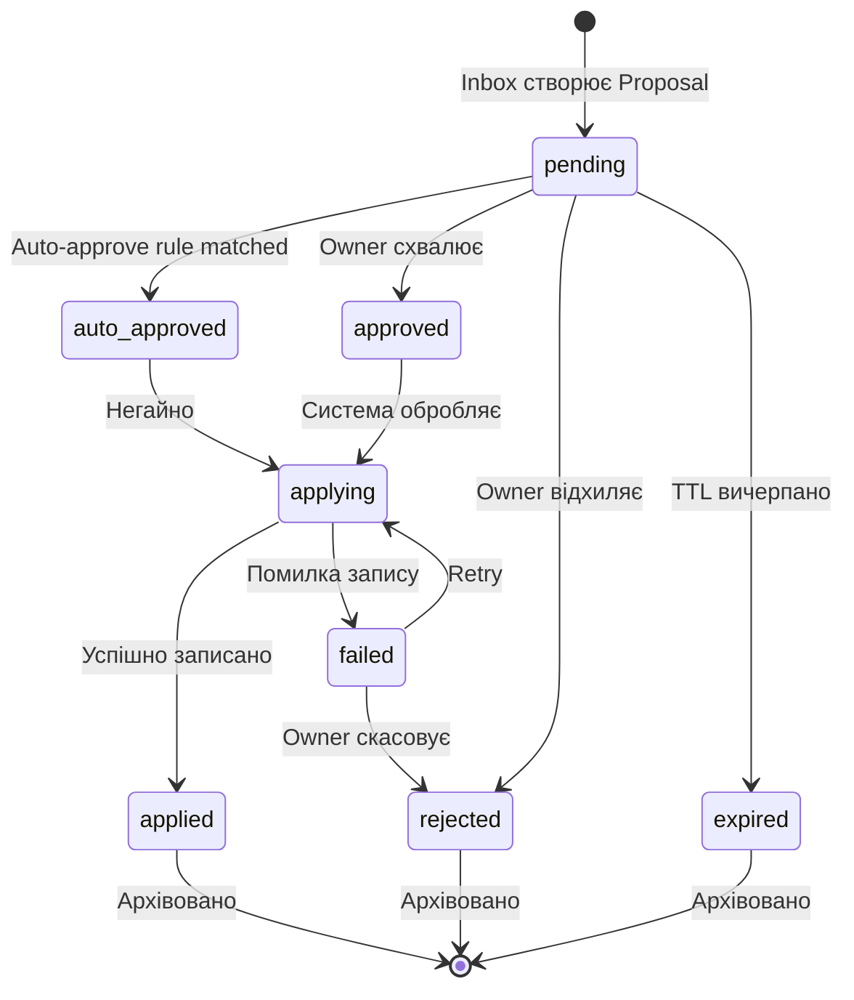

# Proposal System V1

> Створено: 2026-02-15
> Автор: Головний архітектор системи
> Джерело деталей: INBOX_ТА_PROPOSAL_АРХІТЕКТУРА.md
> Статус: Специфікація для Lovable frontend
> Мова: Українська (канонічна)

---

## 0. Призначення

Цей документ є **витягом** з INBOX_ТА_PROPOSAL_АРХІТЕКТУРА.md, оптимізованим для Lovable frontend імплементації. Він описує:

- State machine для Proposal lifecycle
- Поля, які UI читає та відображає
- Transitions, на які UI реагує
- Семантика стану `reviewing`
- Concurrent proposals handling

Для повних деталей — див. INBOX_ТА_PROPOSAL_АРХІТЕКТУРА.md.

---

## 1. Proposal: State Machine

### 1.1 Серверні стани



### 1.2 Опис серверних станів

| Стан | Значення | Хто встановлює | UI-відображення |
|------|---------|----------------|-----------------|
| **pending** | Proposal створено, очікує рішення | Inbox/Worker | Жовтий badge "Очікує" |
| **auto_approved** | Автоматично схвалено правилом | Worker (rule engine) | Зелений badge "Авто-схвалено" |
| **approved** | Owner явно схвалив | Owner (через UI) | Зелений badge "Схвалено" |
| **applying** | Зміна записується у canonical storage | Worker (Apply Engine) | Spinner "Застосовується..." |
| **applied** | Зміна записана успішно | Worker | Зелений badge "Застосовано" + commit info |
| **rejected** | Owner відхилив | Owner (через UI) | Червоний badge "Відхилено" + причина |
| **expired** | TTL вичерпано | System (cron) | Сірий badge "Прострочено" |
| **failed** | Помилка при записі | Worker | Червоний badge "Помилка" + деталі |

### 1.3 Стан `reviewing` — клієнтський

**[РІШЕННЯ]** `reviewing` є **клієнтським (UI-only) станом**. Серверні стани **не залежать** від того, чи Owner відкрив сторінку proposal.

Обґрунтування:
- Сервер не повинен знати, чи хтось "дивиться" на proposal
- Два Owner (або Owner на двох пристроях) можуть дивитися одночасно
- Мережевий disconnect не повинен впливати на серверний стан

**UI-реалізація:**
- Коли Owner відкриває proposal detail → UI локально позначає як "reviewing"
- Це впливає лише на UI (виділення, фільтрація "переглянутих")
- Сервер не знає про цей стан; proposal залишається `pending`

**Опційний lock (не MVP):**
Якщо в майбутньому потрібна координація між кількома Owner:

```typescript
// Опційне поле у proposal (НЕ стан, а metadata)
interface ProposalLock {
  lockOwner?: string;         // identity того, хто переглядає
  lockExpiresAt?: string;     // auto-expire через 5 хв
}
```

Lock не блокує approve/reject — лише показує "хтось переглядає" (advisory lock).

---

## 2. Proposal: поля для UI

### 2.1 Основна структура

```typescript
interface Proposal {
  id: string;                    // "prop_2026-02-14_xyz789"
  inbox_entry_id: string;        // зв'язок з Inbox entry
  status: ProposalStatus;
  created_at: string;            // ISO 8601
  updated_at: string;            // ISO 8601
  expires_at: string;            // ISO 8601 (TTL)

  source: {
    type: "ui" | "telegram" | "webhook" | "agent" | "cron";
    identity: string;            // хто створив
    run_id?: string;             // якщо від агента
  };

  action: string;                // "propose-edit" | "propose-summary" | ...
  target: {
    type: "note" | "artifact" | "tag" | "comment";
    path: string;                // MinIO/Git path
  };

  content: {
    summary: string;             // короткий опис для списку
    diff: ProposalDiff;          // зміни для Diff View
    reasoning?: string;          // пояснення агента
    citations?: Citation[];      // джерела
  };

  approval: {
    decided_by?: string;         // хто прийняв рішення
    decided_at?: string;         // коли
    decision_note?: string;      // причина (обов'язкова при rejection)
  };

  apply_result: {
    git_commit?: string;         // hash коміту
    minio_path?: string;         // шлях у MinIO
    error?: string;              // деталі помилки
  };

  // Concurrency control
  base_revision?: string;        // hash/version target на момент створення proposal
  target_hash?: string;          // content hash target
}

type ProposalStatus =
  | "pending"
  | "auto_approved"
  | "approved"
  | "applying"
  | "applied"
  | "rejected"
  | "expired"
  | "failed";

interface ProposalDiff {
  type: "append" | "replace" | "create" | "delete";
  position?: string;             // "after-frontmatter" | "end" | line number
  text: string;                  // зміст змін
}

interface Citation {
  source: string;                // ім'я файлу-джерела
  quote: string;                 // цитата
}
```

### 2.2 Поля для списку (compact view)

UI Proposal List використовує:
- `id` — ідентифікатор
- `status` — badge
- `content.summary` — текст preview
- `source.type` + `source.identity` — іконка + ім'я джерела
- `action` — тип дії
- `target.path` — що змінюється
- `created_at` — час
- `expires_at` — countdown до expiry

### 2.3 Поля для detail view

UI Proposal Detail додатково використовує:
- `content.diff` — Diff View
- `content.reasoning` — блок "Обґрунтування"
- `content.citations[]` — блок "Джерела"
- `source.run_id` — лінк на Run Timeline
- `approval.*` — блок "Рішення" (після approve/reject)
- `apply_result.*` — блок "Результат" (після apply)

---

## 3. Concurrent Proposals

### 3.1 Проблема

Два proposals можуть змінювати один і той самий target:
- Agent створює `propose-edit` на `sonata-bwv1001.md`
- Telegram bot створює `propose-note` з тим самим slug

### 3.2 Рішення: Optimistic Concurrency

**[РІШЕННЯ]** Proposal зберігає `base_revision` та `target_hash` на момент створення.

При Apply:
1. Apply Engine перевіряє: чи `target_hash` досі актуальний
2. Якщо target змінився після створення proposal → proposal → `failed` з причиною "conflict"
3. UI показує warning: "Target змінився після створення пропозиції"
4. Owner може: створити новий proposal або force-apply (з явним override)

**UI warning:**

```typescript
interface ConflictWarning {
  type: "target_changed";
  proposal_base_revision: string;
  current_revision: string;
  message: string;               // "Нотатка була змінена після створення цієї пропозиції"
}
```

### 3.3 FIFO порядок

**[РІШЕННЯ]** Proposals на той самий target обробляються FIFO (first-in, first-out). Перший approved → applied. Другий → conflict check.

---

## 4. Endpoints для UI

| Method | Endpoint | Auth | Опис | Response |
|--------|----------|------|------|----------|
| `GET` | `/proposals/pending` | Owner | Список pending proposals | `Proposal[]` |
| `GET` | `/proposals/{id}` | Owner | Деталі proposal | `Proposal` |
| `PATCH` | `/proposals/{id}` | Owner | Approve/reject | `Proposal` (updated) |
| `GET` | `/proposals/history?status=applied,rejected` | Owner | Архів | `Proposal[]` |
| `PATCH` | `/proposals/batch` | Owner | Масова дія | `{updated: number}` |

### 4.1 PATCH /proposals/{id} — Request

```json
{
  "status": "approved",
  "decision_note": "Якість резюме задовільна"
}
```

Або rejection (decision_note обов'язковий):

```json
{
  "status": "rejected",
  "decision_note": "Резюме не відображає ключову тезу про аплікатуру"
}
```

### 4.2 Idempotency

**[РІШЕННЯ]** PATCH /proposals/{id} є **ідемпотентним** для однакового статусу. Повторний `PATCH {status: approved}` на вже approved proposal → 200 OK без змін. Перехід з `applied` назад у `pending` — заборонений (409 Conflict).

---

## 5. Rejection UX

**[РІШЕННЯ]** Rejection **вимагає** `decision_note`:

- UI показує textarea "Причина відхилення" (мінімум 10 символів)
- Причина зберігається у `approval.decision_note`
- Причина відображається в аудит-лозі
- Причина доступна для аналізу агентних помилок (agent memory)

---

## Див. також

- **INBOX_ТА_PROPOSAL_АРХІТЕКТУРА.md** — повна специфікація
- **INBOX_AND_RUN_LIFECYCLE_V1.md** — Inbox та Run lifecycle для UI
- **API_CONTRACTS_V1.md** — повні JSON schemas для всіх endpoints
- **LOVABLE_УЗГОДЖЕННЯ_З_RUNTIME_АРХІТЕКТУРОЮ.md** — контракт frontend з runtime

---

*Цей документ є канонічною специфікацією Proposal System для frontend імплементації.*
