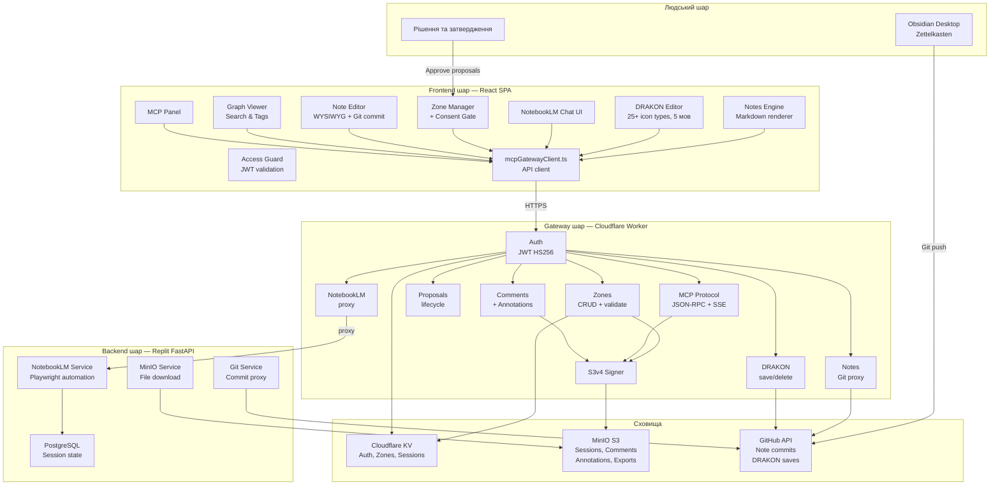
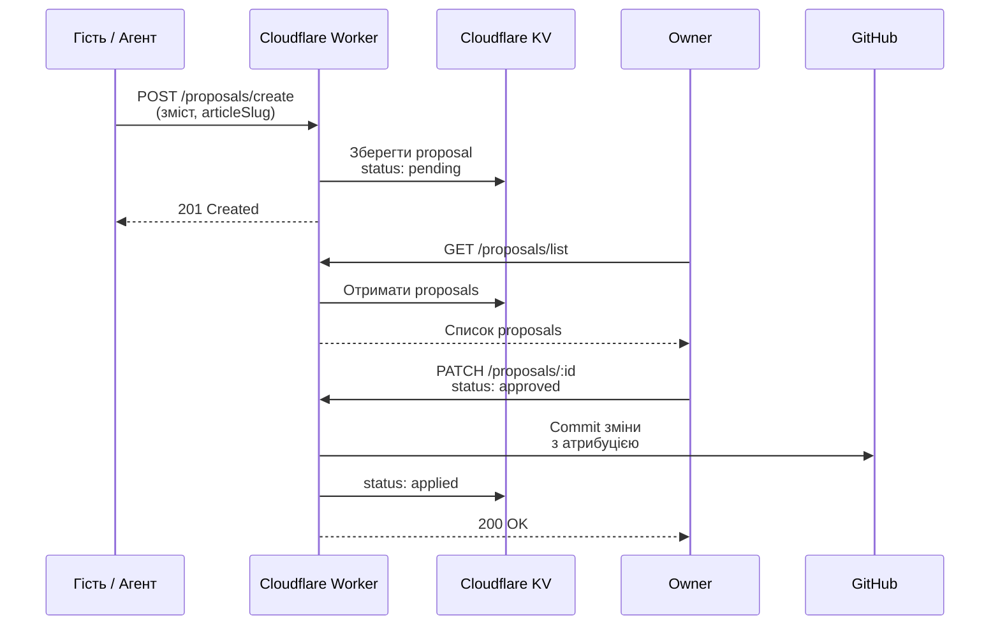
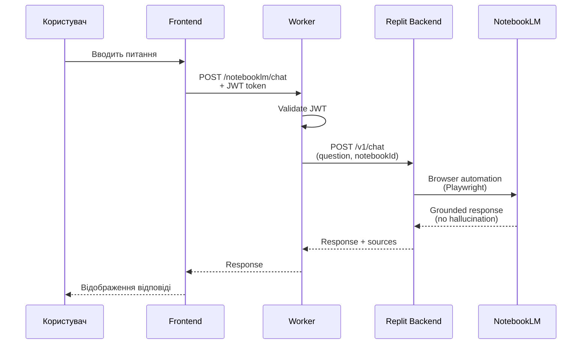

# Архітектурна база системи Garden Seedling

> Відновлено: 2026-02-14
> Джерела: MANIFESTO.md, SYSTEM_OVERVIEW.md, BACKEND_ARCH.md, FRONTEND_ARCH.md, WORKER_ARCH.md, LOVABLE_VISION.md, architecture.md, access-model.md, security.md, comments-system-adr.md, DRAKON integration docs

---

## 1. Інваріанти системи

Інваріанти — це твердження, які не можуть бути порушені жодною реалізацією. Якщо реалізація суперечить інваріанту — реалізація вважається помилковою.

### 1.1 Когнітивний інваріант

**[ПРИНЦИП]** Маніфест є конституцією проєкту. Усі технічні рішення, UX-патерни та архітектурні компроміси повинні узгоджуватися з маніфестом.

**[ПРИНЦИП]** Знання > UI. Інтерфейс є лише проєкцією ролі. База знань є інтелектуальним бекендом.

**[ПРИНЦИП]** Агент без контексту — шкідливий. Контекст без агента — мертвий.

### 1.2 Безпековий інваріант

**[ПРИНЦИП]** Secure by Default — сайт закритий без явного доступу. Жодний контент не доступний без автентифікації або зонного коду.

**[ПРИНЦИП]** Агент не має права мовчки змінювати знання. Будь-яка зміна проходить через proposal → approval.

**[ПРИНЦИП]** NotebookLM не приймає архітектурних рішень, не визначає UX, не керує процесами. Він відповідає строго по джерелах.

### 1.3 Структурний інваріант

**[ПРИНЦИП]** Markdown — головний контракт системи. Папка = агент (або контейнер агента). Файл = інструкція / логіка / пам'ять агента.

**[ПРИНЦИП]** Cloudflare Worker є єдиною точкою входу для всієї комунікації frontend → backend. Frontend ніколи не звертається до Replit Backend напряму.

**[ПРИНЦИП]** Git є джерелом істини для контенту (нотатки, діаграми). MinIO є джерелом істини для файлових артефактів (сесії, експорти, коментарі).

---

## 2. Канонічні джерела істини

| Домен | Канонічне джерело | Формат | Статус |
|-------|-------------------|--------|--------|
| Нотатки (Zettelkasten) | GitHub репозиторій | Markdown файли в `src/site/notes/` | **[ФАКТ]** Працює, рендериться через `import.meta.glob` при збірці |
| DRAKON діаграми | GitHub репозиторій | `.drakon.json` файли | **[ФАКТ]** Зберігаються через Worker → GitHub API |
| Автентифікація (owner) | Cloudflare KV | Хеш пароля в `owner:password_hash` | **[ФАКТ]** JWT HS256 через `crypto.subtle` |
| Зони доступу | Cloudflare KV | JSON-об'єкти зон | **[ФАКТ]** CRUD через Worker |
| MCP сесії (метадані) | Cloudflare KV | Ключ-значення | **[ФАКТ]** |
| MCP сесії (файли) | MinIO S3 | Об'єкти в бакетах | **[ФАКТ]** |
| Коментарі | MinIO S3 (canonical) + Cloudflare KV (індекс) | JSON файли в `comments/{articleSlug}/` | **[ФАКТ]** ADR прийнятий, реалізація часткова |
| NotebookLM стан сесії | PostgreSQL (Replit) | `storage_state.json` | **[ФАКТ]** Крихкий — може протухнути |
| Конфігурація агентів | `_agent.md` файли в папках нотаток | YAML frontmatter + Markdown | **[ПРИПУЩЕННЯ]** Формат визначений в LOVABLE_VISION, реалізація відсутня |
| Маніфест та архітектура | `docs/manifesto/MANIFESTO.md`, `docs/architecture/` | Markdown | **[ФАКТ]** |
| gh-aw референс | `gh-aw/` директорія | Клонований репозиторій | **[ФАКТ]** Не інтегрований у runtime, слугує специфікацією |

---

## 3. Поточна модель виконання агентів

### 3.1 Поточний стан

**[ФАКТ]** Повноцінна агентна система (автономне виконання, DRAKON → агент → дія) **не реалізована**. Існують лише окремі компоненти конвеєра.

### 3.2 Реалізовані компоненти агентного конвеєра

```
DRAKON Editor ─────► pseudocodeToMarkdown() ─────► [РОЗРИВ] ─────► _agent.md
   [ФАКТ]                  [ФАКТ]                                  [ПРИПУЩЕННЯ]
   Повний редактор          Генерація псевдокоду                    Формат визначений,
   25+ типів ікон           з кирилицею та i18n                     рендерер відсутній
```

**[ФАКТ]** Компоненти що працюють:
- DRAKON Editor з повною локалізацією (5 мов) та збереженням через GitHub
- Генерація псевдокоду з локалізованими ключовими словами
- Вбудовування діаграм у нотатки через `:::drakon` директиви
- Зони доступу з consent gate (делегування)
- NotebookLM чат через Worker → Replit Backend (grounded reasoning)
- Система proposals (edit proposals через Worker)
- Система коментарів (MinIO + KV)

**[ФАКТ]** Компоненти що НЕ працюють:
- Colleague Chat — хардкодовані stub-відповіді, не підключений до NotebookLM
- Агентний експорт (`exportAsAgent()`) — не реалізований
- Agent card UI — не реалізований
- Agent execution endpoint — не реалізований
- DRAKON pseudocode interpreter — не реалізований

### 3.3 Модель "агентності" що існує зараз

**[ФАКТ]** Система реалізує **делеговану когнітивну взаємодію**, а не автономних агентів:

```
Людина (Owner)
    │
    ├── Створює зону доступу → Гість отримує код
    │                              │
    │                              ├── Consent Gate → Бачить нотатки зони
    │                              ├── Чат через NotebookLM (grounded)
    │                              └── Propose Edit → Owner Approves
    │
    ├── Пише нотатки (Obsidian / Web Editor)
    │       → Git commit → Rebuild → Видимі у frontend
    │
    ├── Будує логіку (DRAKON Editor)
    │       → Зберігає .drakon.json → GitHub
    │       → Генерує псевдокод
    │
    └── Спілкується з NotebookLM (grounded у джерелах)
```

**[ПРИНЦИП]** Це не автопілот. Це розширений інтелект людини.

---

## 4. Життєвий цикл: Inbox → Run → Proposal → Approval → Apply → Archive

### 4.1 Поточна реалізація

**[ФАКТ]** Повний цикл реалізований лише для **edit proposals**:

```
┌──────────┐     ┌──────────┐     ┌──────────┐     ┌──────────┐     ┌──────────┐
│  Inbox   │────►│   Run    │────►│ Proposal │────►│ Approval │────►│  Apply   │
│          │     │          │     │          │     │          │     │          │
│ Гість    │     │ Гість    │     │ Worker   │     │ Owner    │     │ Worker → │
│ входить  │     │ редагує  │     │ зберігає │     │ переглядає│    │ GitHub   │
│ у зону   │     │ нотатку  │     │ proposal │     │ та вирішує│    │ commit   │
└──────────┘     └──────────┘     └──────────┘     └──────────┘     └──────────┘
                                                                          │
                                                                          ▼
                                                                    ┌──────────┐
                                                                    │ Archive  │
                                                                    │          │
                                                                    │ Git      │
                                                                    │ history  │
                                                                    └──────────┘
```

### 4.2 Фази для агентного виконання (майбутнє)

**[ПРИПУЩЕННЯ]** Плановий цикл для автономних агентів:

| Фаза | Опис | Статус |
|------|------|--------|
| **Inbox** | DRAKON діаграма визначає логіку агента; `_agent.md` створюється з псевдокоду | Частково (DRAKON працює, експорт відсутній) |
| **Run** | Агент активується, запитує NotebookLM, обробляє контекст папки | Не реалізовано |
| **Proposal** | Агент генерує safe-output: пропозицію зміни, резюме, тег | Механізм proposals існує, агентне джерело відсутнє |
| **Approval** | Owner бачить proposal у UI, приймає або відхиляє | UI існує для edit proposals |
| **Apply** | Підтверджена зміна коммітиться в Git з атрибуцією агента | Git commit працює, атрибуція агента відсутня |
| **Archive** | Історія у Git; аудит-лог дій агента | Git history є, аудит-лог не реалізований |

---

## 5. Розподіл відповідальності

### 5.1 MinIO (Canonical Storage)

**[ФАКТ]** Роль: об'єктне сховище для файлових артефактів.

| Що зберігає | Шлях | Використання |
|-------------|------|--------------|
| MCP сесійні файли | `sessions/` | Експорт нотаток для MCP-клієнтів |
| Коментарі | `comments/{articleSlug}/` | Канонічне сховище коментарів |
| Анотації | `annotations/{articleSlug}/` | Inline-анотації до тексту |
| Індекси коментарів | `index/comments/` | Швидкий lookup |
| Федеративні дані | `federation/` | Майбутня фаза |

**[ФАКТ]** Доступ: виключно через Cloudflare Worker з AWS S3v4 підписом. Frontend не має прямого доступу до MinIO.

**[ФАКТ]** Вартість: self-hosted, $0/міс.

### 5.2 Backend (Replit FastAPI)

**[ФАКТ]** Роль: когнітивний оркестраційний шар.

| Відповідальність | Деталі |
|-----------------|--------|
| NotebookLM orchestration | Браузерна автоматизація через `notebooklm-py` (Playwright) |
| Chat endpoint | `POST /v1/chat` — grounded reasoning по джерелах |
| Notebook CRUD | Створення/управління NotebookLM notebooks |
| Source import | Імпорт джерел у notebooks (з MinIO) |
| Git commit proxy | `POST /v1/git/commit` — коміт через GitHub API |
| Persistent store | PostgreSQL для `storage_state.json` та конфігурації |
| Health diagnostics | MinIO, NLM, GitHub перевірки |

**[ФАКТ]** Обмеження:
- NotebookLM auth крихкий — `storage_state.json` може протухнути
- Немає rate limiting — покладається на Worker
- Один deployment (без staging/production)
- Браузерна автоматизація — NotebookLM не має офіційного API

### 5.3 Orchestration Layer (Cloudflare Worker)

**[ФАКТ]** Роль: API gateway, єдина точка входу.

| Відповідальність | Деталі |
|-----------------|--------|
| Автентифікація | JWT HS256 через `crypto.subtle` |
| Авторизація | Owner vs Zone Guest розмежування |
| Маршрутизація | 40+ endpoints у single `index.js` |
| CORS | `Access-Control-Allow-Origin: *` (відоме обмеження) |
| S3v4 signing | Підпис запитів до MinIO |
| Проксі до Backend | Перенаправлення NLM-запитів на Replit |
| Zone management | CRUD зон доступу через KV |
| Proposal lifecycle | Створення, перегляд, затвердження edit proposals |
| MCP protocol | JSON-RPC + SSE transport |

**[ФАКТ]** Технічний борг:
- Монолітний файл ~3327 LOC vanilla JavaScript
- Без TypeScript, без тестів
- CORS wildcard
- Два окремих Worker'и (main + NotebookLM) без уніфікованого деплою

### 5.4 Frontend (Lovable React SPA)

**[ФАКТ]** Роль: візуалізація, взаємодія, редагування.

| Відповідальність | Деталі |
|-----------------|--------|
| Note rendering | Markdown → React через `react-markdown` + `remark-gfm` |
| DRAKON editor | Повний редактор з 25+ типами ікон, 5 мов |
| Pseudocode export | `pseudocodeToMarkdown()` з локалізацією |
| Access Gate | Перевірка автентифікації, zone consent |
| NotebookLM Chat UI | Інтерфейс для grounded reasoning |
| Zone management UI | Створення зон, QR-коди, consent gate |
| MCP session UI | Управління MCP сесіями |
| Note editor | WYSIWYG з Git commit |
| Search & tags | Пошук по нотатках, теги, граф знань |
| i18n | 5 мов (uk, en, fr, de, it) |

**[ФАКТ]** Шаблон взаємодії: всі API-виклики через `mcpGatewayClient.ts` (600+ LOC) з JWT автентифікацією.

**[ФАКТ]** Нотатки бандляться при збірці через `import.meta.glob` — зміни через web editor видимі лише після rebuild.

---

## 6. Архітектурна діаграма

### 6.1 Загальна архітектура системи



### 6.2 Життєвий цикл Proposal



### 6.3 Потік даних NotebookLM



---

## 7. Рівні доступу

**[ФАКТ]** Три рівні:

| Рівень | Механізм | Видимість |
|--------|----------|-----------|
| **Public** | Без автентифікації | Лише сторінка "Access Required" та health check |
| **Zone Guest** | Код зони `ZONE-XXXX-YYYY` | Нотатки зони, пошук по зоні, теги зони, чат NLM, propose edit |
| **Owner** | Master password → JWT | Повний доступ: весь контент, управління зонами, MCP, налаштування |

**[ФАКТ]** Consent Gate (GDPR-подібний) обов'язковий для Zone Guest перед доступом до контенту.

---

## 8. Зовнішні залежності та обмеження

### 8.1 Runtime-залежності

| Залежність | Тип | Ризик |
|-----------|-----|-------|
| Cloudflare Workers | Gateway | Низький — стабільна платформа |
| Cloudflare KV | Metadata store | Низький |
| MinIO (self-hosted) | Object storage | Середній — вимагає підтримки сервера |
| Replit (Always-On) | Backend hosting | Високий — залежність від доступності Replit |
| NotebookLM | Cognitive engine | Високий — немає офіційного API, browser automation |
| GitHub API | Git persistence | Низький — стабільний API |

### 8.2 Vendor-бібліотеки (frontend)

| Бібліотека | Завантаження | Розмір |
|-----------|-------------|--------|
| `drakonwidget.js` | `/libs/drakonwidget.js` (browser global) | ~1.4 MB |
| `drakongen.js` | `/libs/drakongen.js` (browser global) | Не задокументовано |

**[ФАКТ]** Обидві бібліотеки не є npm-пакетами; завантажуються як vendor-копії через dynamic script injection.

---

## 9. Вартість інфраструктури

**[ФАКТ]** Поточна вартість:

| Компонент | Вартість/міс |
|-----------|-------------|
| Cloudflare Worker | $0 (free tier) |
| Cloudflare KV | ~$5 |
| MinIO | $0 (self-hosted) |
| Replit Always-On | Залежить від плану |
| GitHub | $0 (public/free) |
| **Разом** | **~$5/міс + Replit** |

---

## 10. Відомі архітектурні ризики

| Ризик | Опис | Серйозність |
|-------|------|------------|
| Worker monolith | 3327 LOC vanilla JS без типів та тестів; кожен новий endpoint збільшує ймовірність регресій | **[ФАКТ]** Високий |
| NotebookLM fragility | Browser automation; `storage_state.json` протухає; немає офіційного API | **[ФАКТ]** Високий |
| Build-time notes | Зміни через web editor видимі лише після rebuild | **[ФАКТ]** Середній |
| CORS wildcard | `Access-Control-Allow-Origin: *` на Worker | **[ФАКТ]** Середній |
| Colleague Chat stubs | Хардкодовані відповіді; мертвий функціонал | **[ФАКТ]** Низький (UX-борг) |
| Відсутність тестів | Ні на frontend, ні на Worker, ні на backend | **[ФАКТ]** Високий |

---

*Цей документ відновлює істину системи станом на 2026-02-14. Він не пропонує змін — лише фіксує поточний стан архітектури на основі верифікованих джерел.*
