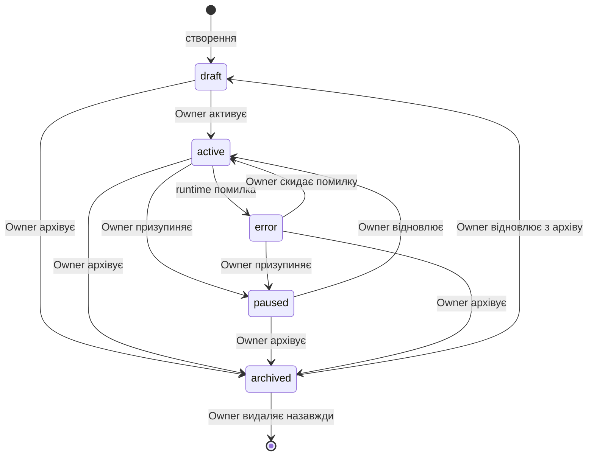

# Контракт агента V1

> Створено: 2026-02-14
> Автор: Архітектор системи
> Базується на: ЦІЛЬОВА_АРХІТЕКТУРА_MASTRA_INNGEST.md, АРХІТЕКТУРНА_БАЗА_СИСТЕМИ.md, MANIFESTO.md
> Статус: Специфікація (V1)

---

## 0. Фундаментальний інваріант

**[ПРИНЦИП]** Логіка агента визначається storage, не runtime.

Це означає:

- Агент існує як **набір файлів у MinIO**, не як об'єкт у пам'яті Mastra.
- Якщо Mastra перезапуститься — агент відновлюється з MinIO без втрат.
- Якщо `_agent.md` видалено з MinIO — агент перестає існувати, незалежно від стану Mastra чи Inngest.
- Зміна поведінки агента = зміна файлу `_agent.md` у MinIO. Не потрібно перезапускати сервіс, деплоїти код, чи змінювати конфігурацію runtime.

**[ПРИНЦИП]** Runtime (Mastra) є **інтерпретатором**, не власником. Він читає визначення, виконує, записує результат назад у storage. Між запусками runtime не зберігає нічого про агента.

---

## 1. Структура папки агента

### 1.1 Канонічна структура

Кожен агент — це папка у MinIO бакеті `garden-agents/`:

```
garden-agents/
└── agents/
    └── <slug>/                     ← унікальний ідентифікатор агента
        │
        ├── _agent.md               ← визначення агента (обов'язковий)
        │
        ├── sources/                ← джерела знань агента
        │   ├── domain-knowledge.md
        │   ├── procedures.md
        │   └── reference-data.csv
        │
        ├── drakon/                 ← DRAKON-діаграми логіки
        │   ├── main-flow.drakon.json
        │   └── error-handling.drakon.json
        │
        ├── memory/                 ← накопичена пам'ять агента
        │   ├── observations.jsonl  ← спостереження з попередніх запусків
        │   └── decisions.jsonl     ← прийняті рішення та їх контекст
        │
        ├── runs/                   ← журнал виконань
        │   └── <run-id>/
        │       ├── manifest.json   ← метадані запуску
        │       ├── steps/          ← проміжні результати кроків
        │       │   ├── 01-<step-name>.json
        │       │   ├── 02-<step-name>.json
        │       │   └── ...
        │       └── output/         ← фінальні артефакти
        │           ├── proposal.json
        │           └── ...
        │
        └── artifacts/              ← довготривалі артефакти агента
            ├── generated-summary.md
            ├── analysis-report.md
            └── ...
```

### 1.2 Опис директорій

| Директорія | Обов'язкова | Хто пише | Хто читає | Призначення |
|-----------|-------------|----------|-----------|-------------|
| `_agent.md` | **Так** | Людина або DRAKON export | Mastra (runtime) | Визначення: хто агент, що робить, які інструменти має |
| `sources/` | Ні | Людина | Mastra (tool: `read-context`) | Джерела знань, які агент використовує для reasoning |
| `drakon/` | Ні | Людина (DRAKON Editor) | Mastra (tool: `read-drakon`), DRAKON export pipeline | Візуальна логіка агента; може бути джерелом для генерації `_agent.md` |
| `memory/` | Ні | Mastra (tool: `write-memory`) | Mastra (tool: `read-memory`) | Накопичений досвід; агент записує спостереження після кожного run |
| `runs/` | Ні (створюється автоматично) | Inngest + Mastra | Frontend (перегляд), аудит | Повний журнал кожного виконання |
| `artifacts/` | Ні | Mastra (через proposal → apply) | Людина, Frontend, інші агенти | Довготривалі результати роботи агента |

### 1.3 Правила

**[ПРИНЦИП]** Єдиний обов'язковий файл — `_agent.md`. Папка з одним `_agent.md` — це валідний агент. Усі інші директорії створюються за потреби.

**[ПРИНЦИП]** Папка без `_agent.md` — це **не агент**. Навіть якщо в ній є `sources/` та `drakon/`. Файл `_agent.md` є маркером існування агента.

**[ОБМЕЖЕННЯ]** `runs/` є append-only. Результати виконань не можуть бути змінені або видалені (лише архівовані).

**[ОБМЕЖЕННЯ]** `memory/` записується агентом, але **контролюється Owner**. Owner може видалити або відредагувати пам'ять агента через UI.

---

## 2. Структура `_agent.md`

### 2.1 Формат

`_agent.md` складається з двох частин:
1. **YAML frontmatter** — структурована конфігурація
2. **Markdown body** — інструкції агента (system prompt)

### 2.2 YAML frontmatter — повна специфікація

```yaml
---
# ── Ідентичність ──────────────────────────────────────────────
name: "Назва агента"                    # обов'язкове; людиночитана назва
slug: "agent-slug"                      # обов'язкове; унікальний id, [a-z0-9-]
version: "1.0.0"                        # обов'язкове; semver
description: "Короткий опис ролі"       # обов'язкове; одне речення

# ── Модель ─────────────────────────────────────────────────────
model: "claude-sonnet-4-5-20250929"     # обов'язкове; ідентифікатор LLM
temperature: 0.3                        # опціонально; default 0.3
max_steps: 5                            # опціонально; default 5; ліміт ітерацій

# ── Інструменти ────────────────────────────────────────────────
tools:                                  # обов'язкове; мінімум 1 safe-output tool
  - notebooklm-query                    # запит до NotebookLM (grounded reasoning)
  - read-context                        # читання sources/ агента
  - read-notes                          # читання Zettelkasten нотаток
  - create-proposal                     # створення proposal (safe output)
  - read-memory                         # читання memory/ агента
  - write-memory                        # запис у memory/ агента
  - read-drakon                         # читання DRAKON-діаграм
  - search-notes                        # пошук по нотатках

# ── Safe outputs ───────────────────────────────────────────────
safe_outputs:                           # обов'язкове; що агент може генерувати
  - propose-edit                        # пропозиція редагування нотатки
  - propose-summary                     # пропозиція резюме
  - propose-tag                         # пропозиція тегу
  - propose-artifact                    # пропозиція нового артефакту

# ── Тригери ────────────────────────────────────────────────────
triggers:                               # опціонально; коли агент запускається
  manual: true                          # дозволити ручний запуск через UI
  cron: "0 8 * * 1"                     # розклад (cron-синтаксис); null = вимкнено
  events:                               # реакція на події; null = вимкнено
    - "note/created"
    - "comment/approved"

# ── Контекст ───────────────────────────────────────────────────
context:
  folder: "violin.pp.ua"                # опціонально; slug папки знань
  max_sources: 10                       # опціонально; default 10; ліміт джерел за запит
  notebook_id: "nb_abc123"              # опціонально; ID NotebookLM notebook

# ── Metadata ───────────────────────────────────────────────────
created_at: "2026-02-14T12:00:00Z"      # обов'язкове; ISO 8601
updated_at: "2026-02-14T12:00:00Z"      # обов'язкове; ISO 8601
created_by: "owner"                     # обов'язкове; хто створив
generated_from: "main-flow.drakon.json" # опціонально; якщо згенеровано з DRAKON
status: "active"                        # обов'язкове; див. §4 Стани агента
---
```

### 2.3 Markdown body — інструкції агента

Markdown body є **system prompt** агента. Він може містити:

1. **Природну мову** — прямі інструкції
2. **Псевдокод** — згенерований з DRAKON (див. §3)
3. **Комбінацію** — природна мова + вбудований псевдокод

```markdown
# Інструкції

Ти — агент-архіваріус папки "violin.pp.ua".

## Твоя роль

Аналізувати нові нотатки у папці та створювати структуровані резюме
для швидкого пошуку та навігації.

## Процедура

1. Прочитай список нотаток у папці (tool: read-notes)
2. Для кожної нової нотатки (без тегу "summarized"):
   a. Прочитай повний текст нотатки
   b. Запитай NotebookLM: "Створи структуроване резюме цієї нотатки"
   c. Створи proposal: propose-summary з результатом
3. Запиши в memory спостереження про оброблені нотатки

## Обмеження

- НЕ змінюй оригінальний текст нотаток
- НЕ створюй резюме для нотаток коротших за 200 слів
- Якщо NotebookLM недоступний — зупинись і запиши помилку в run log
```

### 2.4 Обов'язкові та опціональні поля

| Поле | Обов'язкове | Валідація |
|------|-------------|-----------|
| `name` | Так | Непорожній рядок |
| `slug` | Так | `^[a-z0-9][a-z0-9-]*$`, унікальний у системі |
| `version` | Так | Semver формат |
| `description` | Так | Непорожній рядок |
| `model` | Так | Валідний model ID |
| `tools` | Так | Масив ≥1 елемент; має містити хоча б один safe-output tool |
| `safe_outputs` | Так | Масив ≥1 елемент |
| `status` | Так | Одне з визначених значень (§4) |
| `created_at` | Так | ISO 8601 |
| `updated_at` | Так | ISO 8601 |
| `created_by` | Так | Непорожній рядок |
| `temperature` | Ні | 0.0–1.0; default 0.3 |
| `max_steps` | Ні | 1–20; default 5 |
| `triggers` | Ні | Об'єкт; default `{manual: true}` |
| `context` | Ні | Об'єкт |
| `generated_from` | Ні | Ім'я файлу `.drakon.json` |

**[ПРИНЦИП]** Якщо агент не має жодного safe-output tool у `tools[]` — він не може бути активований. Агент без safe-output не здатний впливати на систему.

---

## 3. Роль псевдокоду з DRAKON

### 3.1 Два шляхи створення агента

```
Шлях A: Людина → _agent.md (вручну)
        Прямі інструкції природною мовою.
        Підходить для простих агентів з лінійною логікою.

Шлях B: Людина → DRAKON-діаграма → pseudocodeToMarkdown() → _agent.md
        Візуальна побудова логіки → автоматична генерація інструкцій.
        Підходить для агентів зі складною логікою, розгалуженнями, циклами.
```

### 3.2 DRAKON → `_agent.md` конвеєр

```
┌──────────────────┐
│  DRAKON Editor   │  Людина будує діаграму візуально
│  (Frontend)      │  у DRAKON Editor з локалізацією
└────────┬─────────┘
         │ Save
         ▼
┌──────────────────┐
│  main-flow       │  Діаграма зберігається у MinIO
│  .drakon.json    │  agents/<slug>/drakon/
└────────┬─────────┘
         │ Export
         ▼
┌──────────────────┐
│  drakongen       │  pseudocodeToMarkdown()
│  (Frontend lib)  │  Генерує локалізований псевдокод
└────────┬─────────┘
         │
         ▼
┌──────────────────┐
│  agentExporter() │  Обгортає псевдокод у YAML frontmatter
│  (нова функція)  │  Встановлює generated_from, tools, safe_outputs
└────────┬─────────┘
         │ Save
         ▼
┌──────────────────┐
│  _agent.md       │  Готовий агент у MinIO
│  (MinIO)         │  agents/<slug>/_agent.md
└──────────────────┘
```

### 3.3 Формат псевдокоду у `_agent.md`

Коли `_agent.md` згенерований з DRAKON, його Markdown body містить псевдокод:

```markdown
# Логіка (згенеровано з main-flow.drakon.json)

ПОЧАТОК "Аналіз нових нотаток"

  нотатки ← read-notes(folder)

  ЯКЩО нотатки порожні
    write-memory("Нових нотаток немає")
    → КІНЕЦЬ

  ДЛЯ КОЖНОЇ нотатка З нотатки
    ЯКЩО нотатка.має_тег("summarized")
      → НАСТУПНА

    зміст ← read-context(нотатка.slug)

    ЯКЩО довжина(зміст) < 200 слів
      → НАСТУПНА

    відповідь ← notebooklm-query("Створи резюме", зміст)

    create-proposal(
      тип: "propose-summary",
      нотатка: нотатка.slug,
      зміст: відповідь
    )

КІНЕЦЬ
```

### 3.4 Зв'язок діаграми та агента

**[РІШЕННЯ]** Поле `generated_from` у frontmatter вказує на DRAKON-файл, з якого згенеровано інструкції. Це забезпечує:

- **Traceability** — завжди можна знайти діаграму-джерело
- **Re-generation** — при зміні діаграми можна перегенерувати `_agent.md`
- **Versioning** — `version` у frontmatter змінюється при перегенерації

**[ОБМЕЖЕННЯ]** Якщо людина вручну змінила Markdown body після генерації з DRAKON — `generated_from` має бути видалений або позначений як `generated_from: "main-flow.drakon.json # modified manually"`. Runtime не перевіряє відповідність діаграми та інструкцій.

**[ПРИНЦИП]** DRAKON-діаграма є **авторитетним джерелом логіки**. Якщо є розбіжність між діаграмою та Markdown body — діаграма має пріоритет, і `_agent.md` має бути перегенерований.

---

## 4. Стани агента

### 4.1 Діаграма переходів



### 4.2 Опис станів

| Стан | Значення поля `status` | Дозволяє запуск | Хто переводить | Опис |
|------|----------------------|-----------------|----------------|------|
| **Draft** | `draft` | Ні | Людина | Агент створений, але не готовий до виконання. Може мати неповні інструкції або відсутні tools |
| **Active** | `active` | Так | Людина | Агент готовий до виконання. Реагує на тригери (manual, cron, events) |
| **Paused** | `paused` | Ні | Людина | Агент тимчасово зупинений. Тригери ігноруються. Дані та пам'ять зберігаються |
| **Error** | `error` | Ні | Runtime (автоматично) | Останній run завершився критичною помилкою. Потребує уваги Owner |
| **Archived** | `archived` | Ні | Людина | Агент деактивований. Зберігається для історії. Може бути відновлений |

### 4.3 Правила переходів

**[ПРИНЦИП]** Лише людина (Owner) може переводити агента в стани `active`, `paused`, `archived`. Runtime може лише встановити `error`.

**[ПРИНЦИП]** Перехід `active → error` відбувається автоматично, якщо run завершився з критичною помилкою (NotebookLM недоступний, MinIO недоступний, перевищено max_steps без результату).

**[ОБМЕЖЕННЯ]** Видалення агента (перехід `archived → [*]`) видаляє всю папку `agents/<slug>/` з MinIO. Це незворотна операція, яка потребує явного підтвердження.

**[ОБМЕЖЕННЯ]** Агент у стані `draft` не може бути запущений навіть вручну. Це захист від виконання неготових визначень.

### 4.4 Зберігання стану

Стан зберігається у полі `status` файлу `_agent.md` (frontmatter). Зміна стану = зміна файлу у MinIO.

Додатково: `error_details` записується в `runs/<last-run-id>/manifest.json` при переході в `error`. Frontend читає ці дані для відображення діагностики.

---

## 5. Реєстр агентів

**[РІШЕННЯ]** Файл `garden-agents/registry.json` є кешованим індексом усіх агентів.

```json
{
  "version": "1",
  "updated_at": "2026-02-14T12:00:00Z",
  "agents": [
    {
      "slug": "archivist-violin",
      "name": "Архіваріус Violin",
      "status": "active",
      "version": "1.0.0",
      "last_run": "2026-02-14T08:00:00Z",
      "last_run_status": "completed",
      "pending_proposals": 2
    }
  ]
}
```

**[ОБМЕЖЕННЯ]** `registry.json` є **кешем**, не джерелом істини. Джерело істини — файли `_agent.md` у папках агентів. При розбіжності registry перебудовується з файлової системи.

---

## 6. Повний приклад

### 6.1 Структура папки

```
garden-agents/agents/archivist-violin/
│
├── _agent.md
│
├── sources/
│   ├── violin-taxonomy.md
│   ├── note-formatting-guide.md
│   └── summary-template.md
│
├── drakon/
│   └── main-flow.drakon.json
│
├── memory/
│   ├── observations.jsonl
│   └── decisions.jsonl
│
├── runs/
│   ├── run_2026-02-14_080000_abc123/
│   │   ├── manifest.json
│   │   ├── steps/
│   │   │   ├── 01-load-context.json
│   │   │   ├── 02-list-notes.json
│   │   │   ├── 03-nlm-summarize.json
│   │   │   └── 04-create-proposal.json
│   │   └── output/
│   │       └── proposal-summary-sonata-bwv1001.json
│   └── run_2026-02-13_080000_def456/
│       ├── manifest.json
│       ├── steps/
│       │   └── 01-load-context.json
│       └── output/
│           └── (empty — no new notes found)
│
└── artifacts/
    ├── weekly-digest-2026-w07.md
    └── folder-index.md
```

### 6.2 Приклад `_agent.md`

```markdown
---
name: "Архіваріус Violin"
slug: "archivist-violin"
version: "1.2.0"
description: "Аналізує нові нотатки у папці violin.pp.ua та створює структуровані резюме"

model: "claude-sonnet-4-5-20250929"
temperature: 0.2
max_steps: 8

tools:
  - notebooklm-query
  - read-context
  - read-notes
  - read-memory
  - write-memory
  - create-proposal

safe_outputs:
  - propose-summary
  - propose-tag

triggers:
  manual: true
  cron: "0 8 * * 1-5"
  events:
    - "note/created"

context:
  folder: "violin.pp.ua"
  max_sources: 5
  notebook_id: "nb_violin_main"

created_at: "2026-02-01T10:00:00Z"
updated_at: "2026-02-14T12:00:00Z"
created_by: "owner"
generated_from: "main-flow.drakon.json"
status: "active"
---

# Архіваріус: інструкції

Ти — агент-архіваріус папки "violin.pp.ua" у Digital Garden.

## Роль

Ти відповідаєш за підтримку актуальних резюме нотаток у папці.
Кожна нова або змінена нотатка повинна мати структуроване резюме
для швидкої навігації та пошуку.

## Джерела

Ти працюєш **виключно** на основі:
- Нотаток у папці violin.pp.ua (tool: read-notes)
- Джерел у sources/ (tool: read-context)
- Відповідей NotebookLM (tool: notebooklm-query)

Ти **не** вигадуєш інформацію. Якщо джерело не містить відповіді —
повідом про це у proposal.

## Процедура

ПОЧАТОК "Щоденний аналіз"

  нотатки ← read-notes("violin.pp.ua")
  пам'ять ← read-memory()
  оброблені ← пам'ять.оброблені_slugs

  ДЛЯ КОЖНОЇ нотатка З нотатки
    ЯКЩО нотатка.slug Є В оброблені
      ЯКЩО нотатка.updated_at <= пам'ять.останній_run
        → НАСТУПНА

    зміст ← read-context(нотатка.slug)

    ЯКЩО довжина(зміст) < 200 слів
      → НАСТУПНА

    резюме ← notebooklm-query(
      "Створи структуроване резюме цієї нотатки. "
      "Включи: основну тезу, ключові поняття, зв'язки з іншими темами.",
      джерело: зміст
    )

    теги ← notebooklm-query(
      "Запропонуй 3-5 тегів для цієї нотатки на основі її змісту.",
      джерело: зміст
    )

    create-proposal(
      тип: "propose-summary",
      нотатка: нотатка.slug,
      зміст: резюме
    )

    create-proposal(
      тип: "propose-tag",
      нотатка: нотатка.slug,
      теги: теги
    )

  write-memory(
    оброблені: оновлений_список,
    останній_run: поточний_час
  )

КІНЕЦЬ

## Обмеження

- Не змінюй оригінальний текст нотаток — лише створюй proposals
- Не створюй резюме для нотаток коротших за 200 слів
- Максимум 10 proposals за один run
- Якщо NotebookLM недоступний — зупинись, запиши помилку в run log
- Якщо нотатка вже має актуальне резюме — пропусти
```

### 6.3 Приклад `runs/<run-id>/manifest.json`

```json
{
  "run_id": "run_2026-02-14_080000_abc123",
  "agent_slug": "archivist-violin",
  "agent_version": "1.2.0",
  "trigger": "cron",
  "started_at": "2026-02-14T08:00:00Z",
  "finished_at": "2026-02-14T08:02:34Z",
  "status": "completed",
  "steps_count": 4,
  "proposals_created": 2,
  "model_used": "claude-sonnet-4-5-20250929",
  "tokens_used": {
    "input": 4200,
    "output": 1100
  },
  "error": null
}
```

### 6.4 Приклад `memory/observations.jsonl`

```jsonl
{"ts":"2026-02-13T08:00:00Z","run":"run_2026-02-13_080000_def456","observation":"Нових нотаток у папці не знайдено"}
{"ts":"2026-02-14T08:02:34Z","run":"run_2026-02-14_080000_abc123","observation":"Оброблено 2 нові нотатки: sonata-bwv1001, partita-bwv1002. Створено 2 propose-summary, 2 propose-tag"}
```

---

## 7. Валідація контракту

**[РІШЕННЯ]** Перед активацією агента (перехід `draft → active`) система перевіряє:

| Перевірка | Критерій | Наслідок при порушенні |
|-----------|----------|----------------------|
| `_agent.md` існує | Файл присутній у папці | Агент не може існувати |
| Frontmatter валідний | YAML парситься, обов'язкові поля присутні | Не можна активувати |
| `slug` унікальний | Жодного іншого агента з таким slug | Не можна активувати |
| `tools[]` не порожній | Хоча б один інструмент | Не можна активувати |
| `safe_outputs[]` не порожній | Хоча б один safe output | Не можна активувати |
| `model` валідний | Model ID розпізнається Mastra | Не можна активувати |
| Safe output tool присутній | `tools[]` містить хоча б один tool з `safe_outputs[]` | Не можна активувати |
| Markdown body непорожній | Є інструкції після frontmatter | Попередження (можна активувати) |

---

*Цей документ є специфікацією контракту агента V1. Зміни до контракту вимагають оновлення версії документа та узгодження з ЦІЛЬОВА_АРХІТЕКТУРА_MASTRA_INNGEST.md.*
