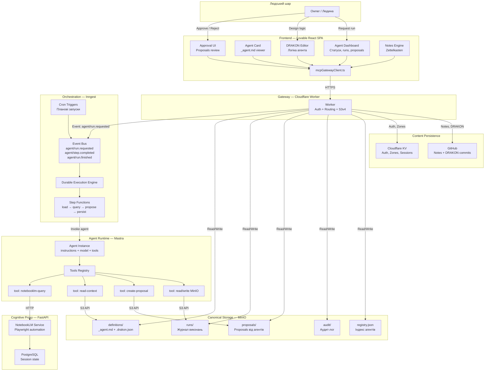
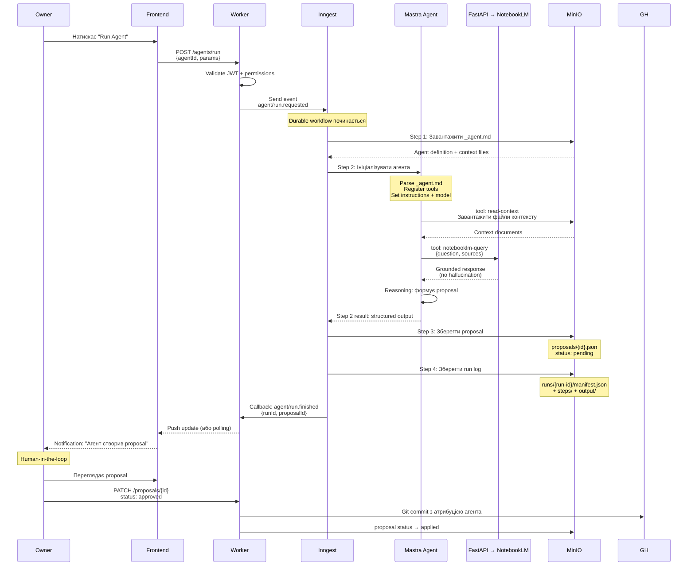

# Цільова архітектура: Mastra + Inngest

> Створено: 2026-02-14
> Автор: Архітектор системи
> Базується на: АРХІТЕКТУРНА_БАЗА_СИСТЕМИ.md, MANIFESTO.md, SYSTEM_OVERVIEW.md
> Статус: Архітектурне рішення (цільовий стан)

---

## 0. Контекст переходу

Поточна система (див. АРХІТЕКТУРНА_БАЗА_СИСТЕМИ.md) реалізує **делеговану когнітивну взаємодію** — людина працює через UI, NotebookLM відповідає по джерелах, proposals проходять через approval. Повноцінна агентна система (автономне виконання, DRAKON → агент → дія) не реалізована.

Цей документ описує цільову архітектуру, де:
- **Mastra** стає runtime-інтерпретатором агентів (визначених у `_agent.md`)
- **Inngest** стає системою оркестрації (тригери, кроки, durability)
- **MinIO** залишається канонічним сховищем
- **FastAPI** залишається когнітивним проксі до NotebookLM
- **Lovable Frontend** стає проєкцією стану системи

---

## 1. Фундаментальний інваріант

**[ПРИНЦИП]** Mastra і Inngest **НЕ є джерелами істини**. Вони є виконавцями та оркестраторами. Канонічним сховищем залишається MinIO.

Це означає:

| Компонент | Що він зберігає | Що він НЕ зберігає |
|-----------|----------------|-------------------|
| **MinIO** | Визначення агентів, результати виконання, proposals, артефакти, аудит-лог | — |
| **Mastra** | Тимчасовий стан виконання агента (in-memory) | Персистентні дані, визначення агентів, результати |
| **Inngest** | Стан workflow-кроків (durable execution engine) | Бізнес-дані, файли, визначення агентів |

**[ПРИНЦИП]** Якщо Mastra або Inngest втрачають стан — система відновлюється з MinIO. Якщо MinIO втрачає дані — система втрачає дані. Це асиметрія за задумом.

**[ПРИНЦИП]** Агент не має права мовчки змінювати знання. Будь-який результат агента проходить через proposal → approval → apply. Цей інваріант успадкований з маніфесту і не змінюється введенням Mastra/Inngest.

---

## 2. Ролі компонентів

### 2.1 MinIO — канонічна файлова система агентів

**[РІШЕННЯ]** MinIO розширює свою роль від сховища артефактів до **повної файлової системи агентної підсистеми**.

```
garden-agents/                          ← новий бакет
├── definitions/                        ← визначення агентів
│   └── {folder-slug}/
│       ├── _agent.md                   ← YAML frontmatter + інструкції
│       ├── _agent.drakon.json          ← логіка (DRAKON-діаграма)
│       └── _agent.context/             ← контексті файли агента
│           ├── source-1.md
│           └── source-2.md
│
├── runs/                               ← журнал виконань
│   └── {run-id}/
│       ├── manifest.json               ← метадані запуску
│       ├── steps/                       ← результати кроків
│       │   ├── 01-context-loaded.json
│       │   ├── 02-nlm-response.json
│       │   └── 03-proposal-created.json
│       └── output/                     ← фінальні артефакти
│           └── proposal.md
│
├── proposals/                          ← proposals від агентів
│   └── {proposal-id}.json
│
├── audit/                              ← аудит-лог
│   └── {YYYY-MM}/
│       └── {run-id}.jsonl
│
└── registry.json                       ← реєстр усіх агентів (індекс)
```

**[ПРИНЦИП]** Визначення агента (`_agent.md`) зберігається у MinIO, не у коді Mastra. Mastra завантажує визначення при кожному запуску і не кешує між запусками.

**[ПРИНЦИП]** Кожне виконання агента (`run`) створює повний запис у `runs/` з усіма проміжними результатами. Це забезпечує відтворюваність та аудит.

### 2.2 FastAPI — когнітивний проксі до NotebookLM

**[РІШЕННЯ]** Роль FastAPI backend не змінюється. Він залишається єдиним шляхом до NotebookLM.

| Відповідальність | Зміна |
|-----------------|-------|
| NotebookLM chat (grounded reasoning) | Без змін |
| Notebook CRUD | Без змін |
| Source import | Без змін |
| Git commit proxy | Без змін |
| Health diagnostics | Без змін |

**[ОБМЕЖЕННЯ]** FastAPI **не знає** про Mastra чи Inngest. Він надає HTTP API, яке викликається як інструмент (tool) агента через Mastra.

**[ОБМЕЖЕННЯ]** NotebookLM залишається крихким (browser automation, немає офіційного API). Це обмеження не вирішується на рівні архітектури — лише ізолюється за інтерфейсом FastAPI.

### 2.3 Inngest — система оркестрації

**[РІШЕННЯ]** Inngest відповідає за **коли**, **в якому порядку** та **з якою надійністю** виконуються кроки агента.

Inngest забезпечує:

| Можливість | Застосування у системі |
|-----------|----------------------|
| **Event-driven тригери** | Подія `agent/run.requested` ініціює виконання агента |
| **Durable execution** | Кожен крок зберігає стан; при збої — retry з останнього успішного кроку |
| **Step-based workflows** | Етапи: load context → query NLM → generate proposal → persist to MinIO |
| **Concurrency control** | Обмеження одночасних запусків одного агента |
| **Cron-тригери** | Планове виконання агентів за розкладом |
| **Timeouts** | Захист від зависання NotebookLM (120с на крок) |

**[ПРИНЦИП]** Inngest **не містить бізнес-логіки агентів**. Він містить лише оркестраційну обгортку: послідовність кроків, retry-політику, timeout-и. Логіка агента живе у Mastra.

**[ОБМЕЖЕННЯ]** Inngest зберігає тимчасовий стан workflow (step results) у власному durable execution engine. Цей стан є **ефемерним** — після завершення workflow, канонічний результат записується у MinIO.

### 2.4 Mastra — runtime-інтерпретатор агентів

**[РІШЕННЯ]** Mastra відповідає за **як** агент думає та діє. Це runtime, де `_agent.md` перетворюється на працюючого агента.

Mastra забезпечує:

| Можливість | Застосування у системі |
|-----------|----------------------|
| **Agent class** | Визначення агента з instructions, model, tools |
| **Tool registration** | Підключення інструментів: `notebooklm-query`, `propose-edit`, `read-context` |
| **LLM orchestration** | Виклик моделі (Claude, GPT-4) з інструкціями агента |
| **Step iteration** | `maxSteps` контролює глибину мислення агента |
| **Structured output** | Агент повертає типізований результат (proposal, summary, tag) |

**[ПРИНЦИП]** Mastra **не зберігає стан між запусками**. Кожне виконання — чисте: завантаження `_agent.md` з MinIO → ініціалізація → виконання → результат у MinIO.

**[РІШЕННЯ]** Маппінг `_agent.md` → Mastra Agent:

```
_agent.md frontmatter          →  Mastra Agent config
─────────────────────────────────────────────────────
name                           →  agent.name
description                    →  agent.description
instructions (markdown body)   →  agent.instructions
model (infer field)            →  agent.model
tools[]                        →  agent.tools (registered)
context_folder                 →  tool: read-context(folder)
safe_outputs[]                 →  output schema validation
```

**[ОБМЕЖЕННЯ]** Mastra підтримує 600+ моделей, але вибір моделі для агента обмежується полем `infer` у `_agent.md`. Система не дозволяє агенту самостійно обирати модель.

### 2.5 Lovable Frontend — проєкція стану

**[РІШЕННЯ]** Frontend відображає стан агентної системи, але **не керує виконанням напряму**. Управління відбувається через події (Inngest events), а не через прямі API-виклики.

Frontend відображає:

| Що | Звідки дані |
|----|------------|
| Список агентів та їх статус | MinIO `registry.json` через Worker |
| Активні виконання (runs) | Inngest API (поточні) + MinIO `runs/` (історія) |
| Proposals від агентів | MinIO `proposals/` через Worker |
| Agent card (`_agent.md` parsed) | MinIO `definitions/` через Worker |
| Аудит-лог | MinIO `audit/` через Worker |

Frontend ініціює:

| Дія | Механізм |
|-----|----------|
| Запуск агента | `POST /agents/run` → Worker → Inngest event `agent/run.requested` |
| Затвердження proposal | `PATCH /proposals/:id` → Worker → MinIO + Git |
| Зупинка агента | `POST /agents/:id/stop` → Worker → Inngest cancel |

**[ПРИНЦИП]** Frontend ніколи не звертається до Mastra чи Inngest напряму. Cloudflare Worker залишається єдиною точкою входу (успадкований інваріант).

---

## 3. Архітектурна діаграма

### 3.1 Загальна архітектура цільового стану



### 3.2 Послідовність виконання агента



---

## 4. Життєвий цикл виконання агента

### 4.1 Фази

```
┌────────────┐    ┌────────────┐    ┌────────────┐    ┌────────────┐    ┌────────────┐    ┌────────────┐
│   DEFINE   │───►│  TRIGGER   │───►│    RUN     │───►│  PROPOSE   │───►│  APPROVE   │───►│   APPLY    │
│            │    │            │    │            │    │            │    │            │    │            │
│ _agent.md  │    │ Inngest    │    │ Mastra     │    │ MinIO      │    │ Owner      │    │ Git +      │
│ DRAKON     │    │ event/cron │    │ agent +    │    │ proposal   │    │ через UI   │    │ MinIO      │
│ MinIO      │    │            │    │ NLM tools  │    │ saved      │    │            │    │ archive    │
└────────────┘    └────────────┘    └────────────┘    └────────────┘    └────────────┘    └────────────┘
      │                                                                                        │
      │                                                                                        ▼
      │                                                                                 ┌────────────┐
      │                                                                                 │  ARCHIVE   │
      └─────────────────── зворотний зв'язок ◄──────────────────────────────────────────│ audit log  │
                           (агент вчиться з                                              │ run history│
                            результатів)                                                 └────────────┘
```

### 4.2 Опис фаз

| Фаза | Відповідальний | Вхід | Вихід | Де зберігається |
|------|---------------|------|-------|-----------------|
| **Define** | Людина (Owner) | Знання, логіка | `_agent.md` + `.drakon.json` | MinIO `definitions/` |
| **Trigger** | Inngest | Подія або cron | Run ID | Inngest event bus |
| **Run** | Mastra (через Inngest steps) | Agent definition + context | Structured output | Inngest durable state (тимчасово) |
| **Propose** | Mastra tool → MinIO | Structured output | `proposal.json` | MinIO `proposals/` |
| **Approve** | Людина (Owner) через Frontend | Proposal review | Рішення (approved/rejected) | MinIO (status update) |
| **Apply** | Worker | Approved proposal | Git commit + archive | GitHub + MinIO `audit/` |
| **Archive** | Worker | Run metadata + steps + output | Повний запис виконання | MinIO `runs/` + `audit/` |

### 4.3 Типи тригерів

| Тригер | Inngest механізм | Приклад |
|--------|-----------------|---------|
| Ручний запуск | `agent/run.requested` event від Worker | Owner натискає "Run" у UI |
| За розкладом | Cron trigger | Щоденний аналіз нових нотаток |
| За подією | Event matching | Новий коментар → агент-модератор |
| За зміною контенту | Event від Git webhook | Нова нотатка → агент-архіваріус |

---

## 5. Межі відповідальності

### 5.1 Матриця відповідальності

| Функція | MinIO | FastAPI | Inngest | Mastra | Worker | Frontend |
|---------|-------|---------|---------|--------|--------|----------|
| Зберігання визначень агентів | **Canonical** | — | — | — | Proxy | Read |
| Зберігання результатів | **Canonical** | — | Temp | — | Proxy | Read |
| Cognitive reasoning (NLM) | — | **Execute** | — | Tool call | — | UI |
| Оркестрація workflow | — | — | **Execute** | — | Trigger | Monitor |
| Інтерпретація `_agent.md` | — | — | — | **Execute** | — | Display |
| Автентифікація | — | — | — | — | **Execute** | Initiate |
| Approval proposals | — | — | — | — | **Execute** | **UI** |
| Git persistence | — | Proxy | — | — | **Execute** | Trigger |
| Аудит | **Store** | — | — | — | Write | Read |

### 5.2 Що кожен компонент НЕ повинен робити

**[ОБМЕЖЕННЯ]** MinIO:
- Не виконує логіки
- Не валідує дані (це відповідальність того, хто пише)
- Не надсилає повідомлень

**[ОБМЕЖЕННЯ]** FastAPI:
- Не знає про агентів, Mastra, Inngest
- Не зберігає визначення агентів
- Не приймає архітектурних рішень
- Відповідає **строго по джерелах** NotebookLM

**[ОБМЕЖЕННЯ]** Inngest:
- Не містить бізнес-логіки агентів (лише оркестрація)
- Не зберігає канонічні дані
- Не має прямого доступу до frontend
- Не викликає NotebookLM напряму (лише через Mastra tool)

**[ОБМЕЖЕННЯ]** Mastra:
- Не зберігає стан між запусками
- Не планує виконання (це роль Inngest)
- Не звертається до MinIO для оркестраційних цілей (лише через tools)
- Не минає proposal → approval цикл

**[ОБМЕЖЕННЯ]** Worker:
- Не виконує агентів (делегує Inngest)
- Не зберігає тривалий стан (делегує MinIO/KV)
- Не знає про внутрішню логіку Mastra

**[ОБМЕЖЕННЯ]** Frontend:
- Не звертається до Mastra, Inngest, FastAPI, MinIO напряму
- Не зберігає стан агентів (лише відображає)
- Не може обійти approval flow

---

## 6. Інструменти агента (Mastra Tools)

**[РІШЕННЯ]** Агенти мають обмежений набір інструментів. Кожен інструмент є ізольованою функцією з визначеними inputs/outputs.

| Інструмент | Опис | Доступ |
|-----------|------|--------|
| `notebooklm-query` | Запит до NotebookLM через FastAPI; grounded reasoning | FastAPI HTTP API |
| `read-context` | Читання файлів контексту агента з MinIO | MinIO S3 API |
| `create-proposal` | Створення proposal у MinIO з structured output | MinIO S3 API |
| `read-notes` | Читання нотаток Zettelkasten | MinIO або GitHub API |
| `search-notes` | Пошук по нотатках за ключовими словами | Worker search API |
| `read-drakon` | Читання DRAKON-діаграми для агента | MinIO S3 API |

**[ПРИНЦИП]** Інструмент `create-proposal` є **єдиним safe-output** агента. Агент не може безпосередньо змінювати нотатки, коммітити в Git чи модифікувати інші артефакти. Лише proposal.

**[ПРИНЦИП]** Набір доступних інструментів визначається полем `tools[]` у `_agent.md`. Агент не може використовувати інструменти, що не перелічені у його визначенні.

---

## 7. Deployment topology

**[РІШЕННЯ]** Mastra та Inngest розгортаються як **єдиний Node.js/TypeScript сервіс**.

```
┌─────────────────────────────────────────────────┐
│          Agent Service (Node.js/TypeScript)       │
│                                                   │
│   ┌──────────────┐    ┌──────────────────────┐   │
│   │   Inngest     │    │   Mastra              │   │
│   │   SDK Client  │    │   Agent Runtime       │   │
│   │              │    │                        │   │
│   │   Functions:  │    │   Agents:              │   │
│   │   - runAgent  │◄──►│   - dynamic from       │   │
│   │   - cronAgent │    │     _agent.md          │   │
│   │              │    │                        │   │
│   │   Events:     │    │   Tools:               │   │
│   │   - received  │    │   - notebooklm-query   │   │
│   │     via HTTP  │    │   - read-context        │   │
│   └──────────────┘    │   - create-proposal     │   │
│                        └──────────────────────┘   │
│                                                   │
│   HTTP endpoint: POST /inngest (serve function)   │
└─────────────────────────────────────────────────┘
         │                          │
         ▼                          ▼
   Inngest Cloud              MinIO + FastAPI
   (або self-hosted)
```

**[РІШЕННЯ]** Inngest може бути розгорнутий у двох варіантах:
- **Inngest Cloud** — managed, без інфраструктури
- **Inngest Dev Server** (self-hosted) — для повного контролю

**[ОБМЕЖЕННЯ]** Mastra потребує Node.js runtime (TypeScript). Це виключає Cloudflare Workers як хост для агентного сервісу (Worker залишається gateway).

---

## 8. Зв'язок з поточною архітектурою

### 8.1 Що залишається без змін

| Компонент | Статус |
|-----------|--------|
| Cloudflare Worker (gateway) | Без змін + нові routes для агентів |
| Cloudflare KV (auth, zones) | Без змін |
| MinIO (storage) | Розширюється новим бакетом `garden-agents/` |
| FastAPI (NLM proxy) | Без змін |
| GitHub (content persistence) | Без змін |
| Frontend (notes, DRAKON, zones) | Без змін + нові компоненти для агентів |
| Access model (3 рівні) | Без змін; агенти працюють під Owner-рівнем |

### 8.2 Що додається

| Компонент | Роль | Нове |
|-----------|------|------|
| **Mastra** | Agent runtime | Новий сервіс |
| **Inngest** | Orchestration | Новий сервіс |
| **Agent Service** | Node.js deployment | Нова інфраструктура |
| `garden-agents/` бакет | Agent data | Нова структура у MinIO |
| Worker agent routes | API | `POST /agents/run`, `GET /agents/list`, `GET /runs/:id` |
| Frontend agent UI | Projection | Agent Dashboard, Agent Card, Run Monitor |

### 8.3 Міграційний шлях

**[РІШЕННЯ]** Впровадження Mastra + Inngest не вимагає зміни існуючих компонентів. Нові компоненти додаються паралельно:

```
Фаза 1: Agent Service (Mastra + Inngest) розгортається окремо
         Worker отримує нові routes для agent API
         MinIO отримує новий бакет garden-agents/

Фаза 2: Frontend отримує Agent Dashboard
         Перший агент запускається через UI

Фаза 3: DRAKON → _agent.md конвеєр з'єднується
         Cron-тригери для планових агентів
```

**[ПРИНЦИП]** Кожна фаза залишає систему у працездатному стані. Якщо впровадження Mastra/Inngest зупиниться на будь-якій фазі — існуюча функціональність не постраждає.

---

## 9. Ризики та обмеження цільової архітектури

| Ризик | Опис | Мітигація |
|-------|------|-----------|
| **Додаткова інфраструктура** | Node.js сервіс потребує хостингу | Replit, Railway, або self-hosted |
| **Inngest vendor lock-in** | Durable execution прив'язаний до Inngest | Inngest open-source; self-hosted опція |
| **Mastra maturity** | Фреймворк молодий (YC-backed, seed stage) | TypeScript, відкритий код, активна розробка |
| **NotebookLM bottleneck** | Єдиний cognitive engine; browser automation | Не вирішується на цьому рівні; ізольований за FastAPI |
| **Складність налагодження** | Три сервіси (Worker + Agent Service + FastAPI) | Аудит-лог у MinIO; Inngest dashboard |
| **Вартість** | Inngest Cloud має paid tier при масштабуванні | Self-hosted для контролю витрат |

---

*Цей документ описує цільовий стан архітектури. Він не є планом впровадження (це окремий документ). Кожне рішення підлягає валідації при реалізації.*
