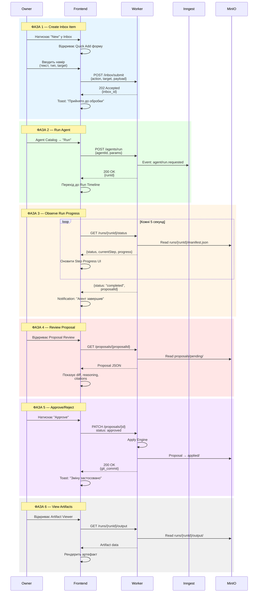
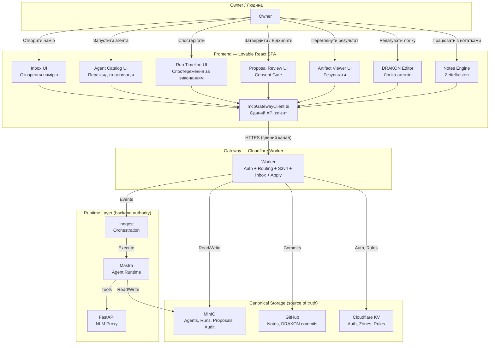

# Lovable Frontend: узгодження з Runtime-архітектурою

> Створено: 2026-02-14
> Автор: Архітектор системи
> Базується на: ЦІЛЬОВА_АРХІТЕКТУРА_MASTRA_INNGEST.md, INBOX_ТА_PROPOSAL_АРХІТЕКТУРА.md, FRONTEND_ARCH.md, КОНТРАКТ_АГЕНТА_V1.md
> Статус: Специфікація для Lovable-імплементаторів
> Мова: Українська (канонічна)

---

## 0. Призначення документа

Цей документ є **контрактом між архітектурою системи та Lovable-імплементатором frontend**. Він визначає:

- Що frontend **повинен** відображати
- Що frontend **не має права** робити
- Як UI-модулі проєктуються на runtime-архітектуру
- Які UX-потоки є канонічними

**[ПРИНЦИП]** Цей документ — не побажання. Це обмеження. Lovable створює UI в межах цих обмежень. Архітектор визначає контракт, Lovable реалізує проєкцію.

---

## 1. Роль frontend у системі

### 1.1 Фундаментальна роль

**[ПРИНЦИП]** Frontend є **проєкцією стану системи**, не джерелом стану.

Frontend:
- **Відображає** дані, що зберігаються у MinIO, GitHub, Cloudflare KV
- **Ініціює** наміри (через Inbox), але не виконує їх
- **Спостерігає** за виконанням агентів, але не керує runtime
- **Надає** інтерфейс для consent gates (Approval UI), але не приймає рішення за систему

**[ІНВАРІАНТ]** Frontend НЕ є source of truth для жодного елемента системи.

Наслідки:

| Аспект | Frontend робить | Frontend НЕ робить |
|--------|----------------|-------------------|
| Стан агентів | Читає з `registry.json` через Worker | Не зберігає стан агентів локально |
| Результати виконання | Відображає з `runs/` через Worker | Не обчислює результати |
| Proposals | Показує список, надає Approval UI | Не зберігає proposals локально |
| Нотатки | Рендерить Markdown, надає editor | Не коммітить напряму в Git |
| DRAKON-діаграми | Надає editor, зберігає через Worker → MinIO | Не інтерпретує діаграми для runtime |
| Auth | Зберігає JWT у localStorage, передає у кожному запиті | Не валідує токени (це робить Worker) |

### 1.2 Шляхи даних

**[ПРИНЦИП]** Frontend ніколи не звертається до Mastra, Inngest, FastAPI або MinIO напряму. Cloudflare Worker є **єдиною точкою входу**.

```
Frontend → mcpGatewayClient.ts → HTTPS → Cloudflare Worker → {MinIO, Inngest, FastAPI, GitHub, KV}
```

**[ОБМЕЖЕННЯ]** Жоден UI-компонент не повинен містити URL або endpoint Mastra, Inngest, FastAPI чи MinIO. Усі запити проходять через `mcpGatewayClient.ts`, який знає лише про Worker endpoint.

### 1.3 Типи проєкцій

| Тип проєкції | Що відображає | Джерело даних | Оновлення |
|-------------|---------------|---------------|-----------|
| **Read-only проєкція** | Статус агентів, run history, аудит-лог | MinIO через Worker | Polling або push |
| **Interactive проєкція** | Approval UI, Agent Catalog з фільтрами | MinIO через Worker | На дію користувача |
| **Editor проєкція** | Note Editor, DRAKON Editor | GitHub/MinIO через Worker | Зберігає через Worker → Inbox |
| **Real-time проєкція** | Run progress, step completion | Inngest status через Worker | Polling з інтервалом |

---

## 2. UI модулі

### 2.1 Inbox UI

**Призначення:** Відображення Inbox entries та створення нових намірів.

**[РІШЕННЯ]** Inbox UI — це головний інтерфейс для "що чекає на мою увагу".

| Елемент | Опис | Джерело |
|---------|------|---------|
| Inbox Feed | Список pending entries (нові нотатки, коментарі, agent results) | `GET /inbox/stats` + `GET /proposals/pending` |
| Quick Add | Форма швидкого введення наміру (note, tag, comment) | `POST /inbox/submit` |
| Source Badge | Іконка джерела (UI, Telegram, Webhook, Agent) | `source.type` у Inbox Entry |
| Priority Indicator | Візуальне позначення priority (normal/high) | `metadata.priority` |
| TTL Counter | Час до expiry для pending entries | `metadata.ttl_hours` |

**[ОБМЕЖЕННЯ]** Inbox UI не фільтрує entries за бізнес-логікою. Фільтрація (Validation Gate) відбувається на Worker. UI показує те, що Worker вже валідував і прийняв.

### 2.2 Agent Catalog UI

**Призначення:** Перегляд, активація та управління агентами.

| Елемент | Опис | Джерело |
|---------|------|---------|
| Agent Card | Картка агента: name, description, status, model, tools | `_agent.md` parsed через Worker |
| Status Badge | Статус агента: `draft` / `active` / `paused` / `error` / `archived` | `registry.json` через Worker |
| Activate Button | Кнопка переводу `draft → active` (Activation Gate) | `POST /agents/:id/activate` |
| Pause/Resume | Тогл `active ↔ paused` | `PATCH /agents/:id` |
| Run Button | Кнопка "Запустити агента зараз" | `POST /agents/run` → Inngest event |
| Agent Detail | Повний перегляд `_agent.md`: instructions, tools, safe_outputs, schedule | MinIO `definitions/` через Worker |

**[ПРИНЦИП]** Agent Catalog відображає **визначення** агентів з MinIO, не runtime-стан Mastra. Якщо Mastra offline — каталог працює (агенти видні, але не запускаються).

**[ОБМЕЖЕННЯ]** UI не дозволяє редагувати `_agent.md` напряму з каталогу. Редагування визначення агента — через DRAKON editor або окремий editor interface, з proposal lifecycle.

### 2.3 Run Timeline UI

**Призначення:** Спостереження за виконанням агентів у реальному часі та перегляд історії.

| Елемент | Опис | Джерело |
|---------|------|---------|
| Active Runs | Список поточних виконань з progress indicator | Inngest status через Worker |
| Step Progress | Покрокова візуалізація: `load → query → propose → persist` | `runs/{run-id}/steps/` |
| Step Detail | Деталі конкретного кроку: input, output, duration, errors | `runs/{run-id}/steps/*.json` |
| Run History | Хронологічний список завершених runs | MinIO `runs/` через Worker |
| Run Summary | Фінальний результат: proposal created, errors, duration | `runs/{run-id}/manifest.json` |
| Error View | Деталі помилок з контекстом для діагностики | `runs/{run-id}/steps/` + `manifest.json` |

**[РІШЕННЯ]** Run Timeline використовує **polling** для active runs (інтервал: 5с). Після завершення run — дані зчитуються з MinIO одноразово.

**[ОБМЕЖЕННЯ]** UI не показує внутрішній стан Mastra (memory, tool calls in-flight). UI показує лише те, що записано у MinIO (`runs/`) або доступне через Worker proxy до Inngest status.

### 2.4 Proposal Review UI

**Призначення:** Перегляд та затвердження/відхилення proposals від агентів, Telegram, webhooks.

| Елемент | Опис | Джерело |
|---------|------|---------|
| Proposal List | Список pending proposals з summary | `GET /proposals/pending` |
| Diff View | Візуалізація пропонованих змін (append, edit, create) | `content.diff` у Proposal JSON |
| Reasoning | Пояснення агента: чому він запропонував цю зміну | `content.reasoning` |
| Citations | Джерела, на які посилається агент | `content.citations[]` |
| Source Info | Хто створив: agent name + run_id, або Telegram user | `source.*` |
| Approve Button | Схвалити → `applying → applied` | `PATCH /proposals/:id` status: approved |
| Reject Button | Відхилити з обов'язковою причиною | `PATCH /proposals/:id` status: rejected |
| Batch Actions | Масове схвалення/відхилення з фільтрами | `PATCH /proposals/batch` |

**[ПРИНЦИП]** Proposal Review UI — це головний **consent gate** системи в UI-формі. Без цього UI Owner не може затвердити жодну агентну зміну.

**[РІШЕННЯ]** Rejection вимагає `decision_note` — текстову причину. Це не UX-примха: причина відхилення зберігається в аудит-лозі і доступна для аналізу агентних помилок.

**[ОБМЕЖЕННЯ]** UI не реалізує auto-approve. Auto-approve — це серверна логіка Worker. UI показує лише proposals, що пройшли через manual review path.

### 2.5 Artifact Viewer UI

**Призначення:** Перегляд артефактів, створених агентами (summaries, analyses, tags).

| Елемент | Опис | Джерело |
|---------|------|---------|
| Artifact Card | Preview артефакту з типом та метаданими | MinIO `runs/{run-id}/output/` |
| Markdown Renderer | Рендеринг Markdown-артефактів (summaries, notes) | `react-markdown` + `remark-gfm` |
| JSON Viewer | Структуровані дані (tag sets, metadata) | JSON tree view |
| Attribution | Хто створив: agent, run, proposal, approval status | Metadata з proposal + run manifest |
| Download | Завантаження оригінального артефакту | MinIO через Worker presigned URL |

**[ОБМЕЖЕННЯ]** Artifact Viewer — read-only. Артефакти не редагуються у UI. Для зміни артефакту потрібен новий proposal.

### 2.6 DRAKON Editor Integration Point

**Призначення:** Редагування візуальної логіки агента через DrakonWidget.

| Елемент | Існуючий компонент | Зміни для агентної системи |
|---------|-------------------|---------------------------|
| DRAKON Editor | `DrakonEditor.tsx` (27KB) | Додати save → MinIO `drakon/` через Worker |
| DRAKON Viewer | `DrakonViewer.tsx` (11KB) | Додати read з `agents/{slug}/drakon/` |
| Pseudocode Panel | `PseudocodePanel` (в Editor) | Без змін; відображає drakongen output |
| Export | Export JSON/SVG | Додати export до `_agent.md` через proposal |

**[ПРИНЦИП]** DRAKON editor інтегрується з агентною системою через Worker API, не напряму з MinIO. Збереження діаграми → `POST /inbox/submit` (action: `propose-drakon-update`) → Proposal → Approval → Apply до MinIO.

**[ОБМЕЖЕННЯ]** Для Owner з auto-approve правилом — save відбувається "миттєво" (Inbox → auto-approve → apply), але lifecycle все одно проходиться повністю. Shortcut, що минає Inbox, заборонений.

---

## 3. UX Lifecycle

### 3.1 Канонічний потік використання

**[РІШЕННЯ]** Основний UX-потік для Owner:

```
1. Create    →  Створити Inbox item (нотатка, запит на агента, tag)
2. Run       →  Запустити агента (вручну або за розкладом)
3. Observe   →  Спостерігати за прогресом виконання (Run Timeline)
4. Review    →  Переглянути proposal від агента (Proposal Review)
5. Decide    →  Затвердити або відхилити proposal (Consent Gate)
6. View      →  Переглянути застосовані артефакти (Artifact Viewer)
```

### 3.2 Детальний UX-потік



### 3.3 Альтернативні UX-потоки

| Потік | Тригер | Відмінність від основного |
|-------|--------|--------------------------|
| Telegram → Review | Telegram bot створює Inbox entry | Owner бачить proposal у Inbox UI без фази Run |
| Cron Agent → Notification | Inngest cron тригер | Без фази Create; Owner отримує notification при completed run |
| Auto-approve | Owner self-proposal або trusted source | Фази Review та Decide відсутні; proposal автоматично applied |
| Rejection | Owner відхиляє proposal | Фаза View показує rejected proposal з decision_note |
| Agent Error | Run завершується з помилкою | Фаза Observe показує error; Proposal не створюється |

---

## 4. Межі авторитету backend

### 4.1 Що вирішує backend (Worker + runtime)

**[ПРИНЦИП]** Backend є **авторитетом** для:

| Аспект | Backend вирішує | Frontend лише |
|--------|----------------|---------------|
| Автентифікація | Валідація JWT, перевірка identity | Зберігає токен, передає у запитах |
| Авторизація | Перевірка прав на дію (Owner, Guest, Agent) | Ховає недоступні UI-елементи (cosmetic) |
| Validation Gate | Валідація Inbox entry (auth, safe_outputs, rate limit) | Показує помилку, якщо entry відхилено |
| Apply | Запис у Git, MinIO, KV | Показує результат (commit hash, applied status) |
| Agent execution | Inngest orchestration + Mastra runtime | Показує progress, не керує виконанням |
| Auto-approve | Оцінка правил, автоматичне схвалення | Не знає про auto-approve (бачить лише результат) |
| Rate limiting | Обмеження запитів від джерела | Показує 429 error |

### 4.2 Що frontend НЕ має права робити

**[ІНВАРІАНТ]** Frontend не змінює canonical storage напряму.

| Заборонена дія | Чому | Правильний шлях |
|---------------|------|-----------------|
| Прямий запис у MinIO | Минає proposal lifecycle | `POST /inbox/submit` → Proposal → Apply |
| Прямий commit у Git | Минає attribution та audit | Worker Apply Engine з атрибуцією |
| Виклик Mastra API | Worker є єдиною точкою входу | `POST /agents/run` через Worker |
| Виклик Inngest API | Worker є єдиною точкою входу | Worker проксює Inngest events |
| Виклик FastAPI/NotebookLM | Worker є єдиною точкою входу | Agent tools викликають через Mastra |
| Зміна auto-approve правил у KV | Привілейована операція | `PATCH /settings/auto-approve` через Worker з Owner auth |
| Активація агента без Owner consent | Agent Activation Gate обов'язковий | UI показує Activate button, Worker валідує |
| Bypass rejection | Відхилений proposal — final | Новий proposal, не зміна існуючого |

### 4.3 UI як cosmetic guard

**[ПРИНЦИП]** Frontend може **ховати** кнопки та елементи на основі ролі (Owner/Guest), але це **не є авторизацією**. Авторизація — на Worker.

```
UI:    Guest бачить disabled "Run Agent" button → cosmetic guard
Worker: Guest надсилає POST /agents/run → 403 Forbidden → enforcement
```

**[ОБМЕЖЕННЯ]** Ніколи не покладатися на frontend для security. Навіть якщо UI приховає кнопку — будь-який HTTP-клієнт може надіслати запит. Worker enforcement — єдиний авторитет.

---

## 5. Архітектурна діаграма

### 5.1 Frontend у контексті повної архітектури



### 5.2 Потік даних: UI → Backend → Orchestration → Runtime → Storage → UI

```mermaid
graph LR
    subgraph "1. UI Projection"
        UI_ACTION["Owner дія<br/>(click, form submit)"]
    end

    subgraph "2. Backend Gateway"
        W_AUTH["Worker: Auth + Validate"]
        W_INBOX["Worker: Inbox / Route"]
    end

    subgraph "3. Orchestration"
        IG_EVENT["Inngest: Event"]
        IG_STEPS["Inngest: Steps"]
    end

    subgraph "4. Runtime"
        MA_AGENT["Mastra: Agent<br/>interpret _agent.md"]
        MA_TOOLS["Mastra: Tools<br/>(NLM, context, propose)"]
    end

    subgraph "5. Canonical Storage"
        S3_WRITE["MinIO: Write<br/>(proposal, run log)"]
    end

    subgraph "6. UI Projection (updated)"
        UI_READ["Frontend: Read<br/>оновлений стан"]
    end

    UI_ACTION --> W_AUTH --> W_INBOX --> IG_EVENT --> IG_STEPS --> MA_AGENT --> MA_TOOLS --> S3_WRITE --> UI_READ

    style UI_ACTION fill:#e3f2fd
    style UI_READ fill:#e3f2fd
    style W_AUTH fill:#fff3e0
    style W_INBOX fill:#fff3e0
    style IG_EVENT fill:#e8f5e9
    style IG_STEPS fill:#e8f5e9
    style MA_AGENT fill:#fce4ec
    style MA_TOOLS fill:#fce4ec
    style S3_WRITE fill:#f3e5f5
```



**[ПРИНЦИП]** Дані рухаються **по колу**: UI → Backend → Runtime → Storage → UI. Frontend бачить лише початок (ініціювання) та кінець (проєкцію). Середні шари — невидимі для UI.

---

## 6. Архітектурні інваріанти frontend

### Інваріант 1: Єдиний канал комунікації

**[ІНВАРІАНТ]** Frontend комунікує з системою **виключно** через `mcpGatewayClient.ts` → Cloudflare Worker. Жоден компонент не може звертатися до інших сервісів напряму.

### Інваріант 2: Проєкція, не авторитет

**[ІНВАРІАНТ]** Frontend є **read-heavy, write-light** система. Основна функція — відображення. Запис відбувається лише через Inbox submit та Proposal approve/reject.

### Інваріант 3: Proposal lifecycle не можна обійти

**[ІНВАРІАНТ]** Будь-яка зміна canonical storage, ініційована з UI, проходить через повний Inbox → Proposal → Consent Gate → Apply цикл. UI не реалізує "direct save" для жодного артефакту.

### Інваріант 4: Auth enforcement на backend

**[ІНВАРІАНТ]** Frontend UI guards (disabled buttons, hidden elements) є **cosmetic**. Авторитетна перевірка прав — на Worker. Frontend повинен коректно обробляти 401/403 відповіді від Worker.

### Інваріант 5: Offline tolerance

**[ІНВАРІАНТ]** Якщо backend (Worker) недоступний — UI показує стан "offline" з останніми кешованими даними. UI не намагається звертатися до альтернативних endpoints.

### Інваріант 6: Agent runtime is opaque

**[ІНВАРІАНТ]** Frontend не знає про внутрішню реалізацію Mastra чи Inngest. UI працює з абстракціями: "agent", "run", "step", "proposal". Зміна runtime (наприклад, заміна Mastra на інший фреймворк) не повинна вимагати змін у frontend.

### Інваріант 7: Audit trail visibility

**[ІНВАРІАНТ]** Кожна дія Owner в UI, що призводить до зміни стану (approve, reject, activate, run), має бути видимою в аудит-лозі. Frontend не виконує дій "тихо".

### Інваріант 8: No local state as truth

**[ІНВАРІАНТ]** `localStorage` та `sessionStorage` використовуються лише для UX-оптимізацій (JWT token, UI preferences, cache). Вони ніколи не є source of truth. Очищення localStorage не повинно призводити до втрати даних — лише до необхідності повторної автентифікації.

---

## 7. Маппінг на існуючі компоненти

### 7.1 Існуючі компоненти та їх еволюція

| Існуючий компонент | Поточна функція | Зміна для агентної системи |
|-------------------|-----------------|---------------------------|
| `mcpGatewayClient.ts` (600+ LOC) | Worker API client | Додати методи: agents, runs, proposals, inbox |
| `DrakonEditor.tsx` (27KB) | DRAKON editor для нотаток | Додати save → agent definition через Inbox |
| `DrakonViewer.tsx` (11KB) | Read-only viewer | Додати read з agent definitions |
| `NoteEditor.tsx` | Note editing з Git commit | Зберігання через Inbox замість прямого commit |
| `NoteRenderer.tsx` | Markdown rendering | Додати rendering agent artifacts |
| `AccessZonesManager.tsx` | Zone CRUD | Без змін |
| `useOwnerAuth.tsx` | JWT auth | Без змін |

### 7.2 Нові компоненти (для створення Lovable)

| Компонент | Розділ | Пріоритет |
|-----------|--------|-----------|
| `InboxFeed.tsx` | Inbox UI | Фаза 2 |
| `QuickAddForm.tsx` | Inbox UI | Фаза 2 |
| `AgentCatalog.tsx` | Agent Catalog UI | Фаза 2 |
| `AgentCard.tsx` | Agent Catalog UI | Фаза 2 |
| `RunTimeline.tsx` | Run Timeline UI | Фаза 2 |
| `StepProgress.tsx` | Run Timeline UI | Фаза 2 |
| `ProposalReview.tsx` | Proposal Review UI | Фаза 2 |
| `DiffView.tsx` | Proposal Review UI | Фаза 2 |
| `ArtifactViewer.tsx` | Artifact Viewer UI | Фаза 2 |

**[РІШЕННЯ]** Нові компоненти створюються у `src/components/garden/` (domain components, territory Lovable). Hooks для них — у `src/hooks/` (territory Claude).

---

---

## Див. також

- **INBOX_AND_RUN_LIFECYCLE_V1.md** — state machines Inbox та Run: стани, transitions, TypeScript interfaces для UI
- **PROPOSAL_SYSTEM_V1.md** — Proposal lifecycle: стани, семантика `reviewing`, concurrent proposals, TypeScript interfaces
- **API_CONTRACTS_V1.md** — повні JSON schemas для всіх endpoints (request/response)

---

*Цей документ визначає контракт frontend з runtime-архітектурою. Він є обов'язковим для Lovable-імплементації. Зміни цього контракту потребують рішення архітектора.*
