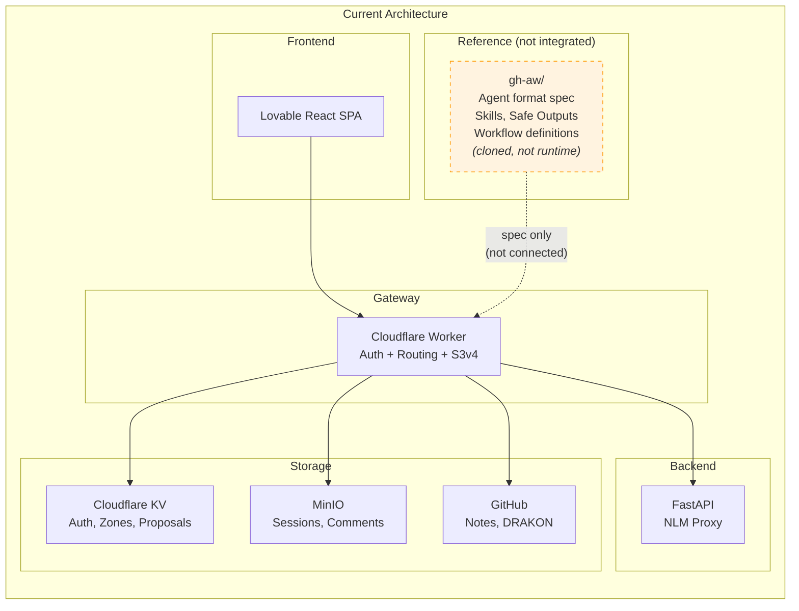
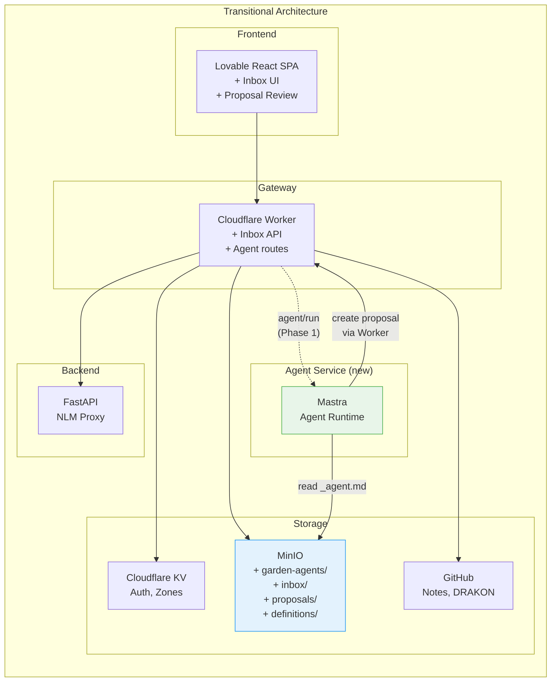
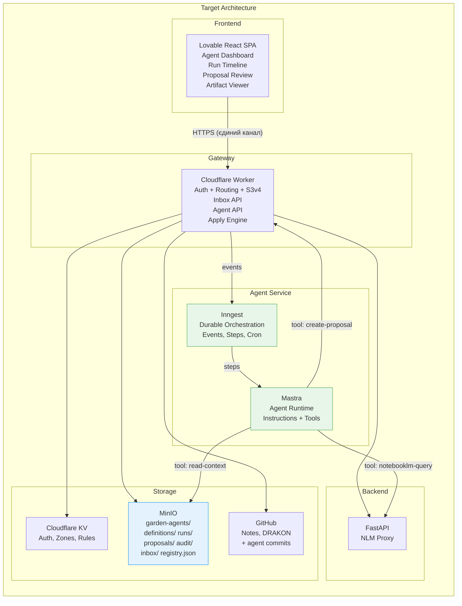
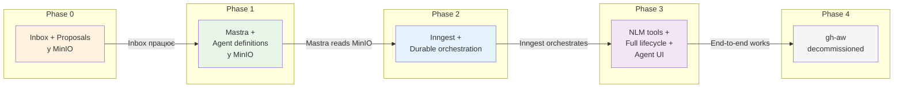
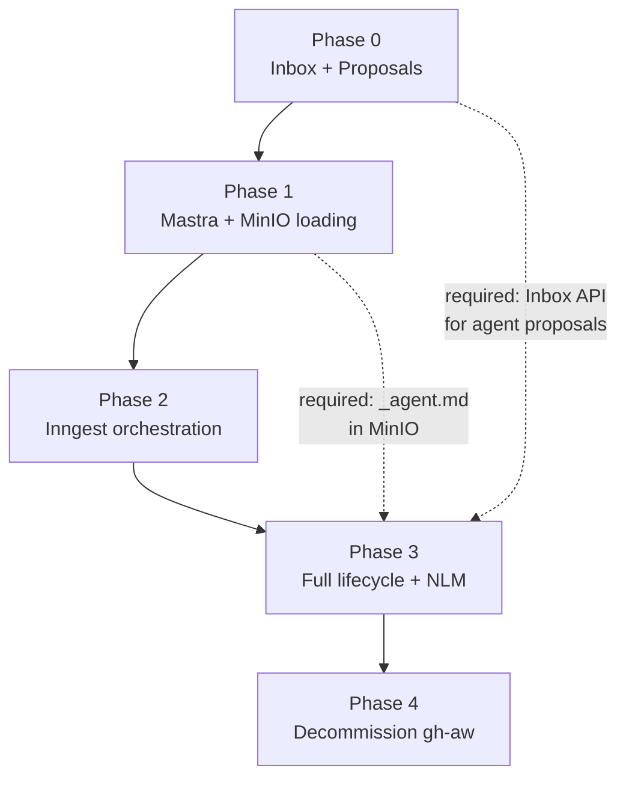

# План міграції: gh-aw → Mastra + Inngest

> Створено: 2026-02-14
> Автор: Головний архітектор системи
> Базується на: АРХІТЕКТУРНА_БАЗА_СИСТЕМИ.md, ЦІЛЬОВА_АРХІТЕКТУРА_MASTRA_INNGEST.md, КОНТРАКТ_АГЕНТА_V1.md, INBOX_ТА_PROPOSAL_АРХІТЕКТУРА.md, DRAKON_ІНТЕГРАЦІЯ_ТА_МОДЕЛЬ_ВИКОНАННЯ_АГЕНТА.md
> Статус: Архітектурний план міграції
> Мова: Українська (канонічна)

---

## 0. Контекст міграції

Система Garden Seedling використовувала **gh-aw** (GitHub Agentic Workflows) як референсну модель для визначення агентів та оркестрації їх виконання. gh-aw — це формат і фреймворк, що базується на GitHub Actions з YAML frontmatter + Markdown body.

Ця модель замінюється на:

- **Mastra** — runtime-інтерпретатор агентів (TypeScript, LLM orchestration)
- **Inngest** — durable orchestration engine (event-driven, step functions)

Canonical storage (MinIO), backend (FastAPI), frontend (Lovable React SPA) та gateway (Cloudflare Worker) **не змінюються**.

**[РІШЕННЯ]** Міграція є заміною orchestration layer, не переписуванням системи. Жодний інваріант з АРХІТЕКТУРНА_БАЗА_СИСТЕМИ.md не порушується.

---

## 1. Роль gh-aw у попередній архітектурі

### 1.1 Що таке gh-aw

**[ФАКТ]** gh-aw (GitHub Agentic Workflows) — це universal agent format specification, розроблений GitHub. Формат: YAML frontmatter (конфігурація) + Markdown body (логіка/інструкції). Файли `.md` компілюються у `.lock.yml` для виконання на GitHub Actions.

**[ФАКТ]** gh-aw був інтегрований у проєкт як **клонований референсний репозиторій** у директорії `gh-aw/`. Він не був підключений до runtime системи. Він слугував специфікацією формату для майбутніх milestone M4–M6.

### 1.2 Функції gh-aw

**[ФАКТ]** gh-aw виконував такі ролі у контексті проєкту:

| Функція | Опис | Статус реалізації |
|---------|------|-------------------|
| **Agent format specification** | YAML frontmatter + Markdown body як універсальний контракт агента | Специфікація адаптована → `_agent.md` формат |
| **Safe Outputs definition** | Структуровані write-операції (create-issue, create-pull-request, add-comment) з human-in-the-loop | Концепт перенесений → `safe_outputs[]` у `_agent.md` |
| **Safe Inputs definition** | Custom lightweight MCP tools з `script:` (JS), `run:` (shell), `py:` (Python) | Концепт перенесений → `tools[]` у `_agent.md` |
| **Skill system** | Переиспользовані domain-specific instruction modules у `skills/<name>/SKILL.md` | Концепт перенесений → `sources/` директорія агента |
| **Schedule / Cron triggers** | Планове виконання через GitHub Actions cron | Не реалізовано; планується через Inngest cron |
| **Agent execution runtime** | GitHub Actions як compute для виконання агентних workflow | Не використовувався; GitHub Actions не підходить для self-hosted архітектури |
| **AWF (Agent Workflow Firewall)** | Network egress control для AI агентів | Не реалізовано; планується на рівні Agent Service |
| **MCP Gateway** | Маршрутизація MCP server calls через unified HTTP gateway | Частково перекривається з Cloudflare Worker MCP endpoint |
| **Workflow lock compilation** | `.md` → `.lock.yml` трансформація для GitHub Actions | Не застосовується; система не використовує GitHub Actions для виконання |

### 1.3 Responsibilities gh-aw

**[ФАКТ]** У контексті архітектури gh-aw ніс такі відповідальності:

| Responsibility | Де жила | Як визначалась |
|---------------|---------|----------------|
| **Agent identity** | YAML frontmatter: `name`, `description`, `model` | Декларативно у файлі `.md` |
| **Agent permissions** | YAML frontmatter: `permissions`, `safe-outputs` | Whitelist дозволених дій |
| **Agent behavior** | Markdown body: natural language instructions | Prompt-подібні інструкції для LLM |
| **Agent tools** | YAML frontmatter: `tools[]`, inline `safe-inputs` | MCP tools або inline scripts |
| **Execution schedule** | YAML: `on.schedule`, `on.workflow_dispatch` | GitHub Actions event model |
| **Execution environment** | GitHub Actions runner (Ubuntu, Node.js) | GitHub-managed compute |
| **State persistence** | GitHub Issues, PRs, Discussions (as side effects) | GitHub API як storage |
| **Orchestration** | GitHub Actions workflow steps | Sequential/parallel steps |

### 1.4 Обмеження gh-aw для Garden Seedling

**[ФАКТ]** gh-aw не підходить як runtime з таких причин:

| Обмеження | Опис |
|-----------|------|
| **GitHub-залежність** | Вимагає GitHub Actions як compute; не працює self-hosted без GitHub |
| **Vendor lock-in** | State у GitHub Issues/PRs; логіка у `.lock.yml`; міграція складна |
| **Відсутність durable execution** | GitHub Actions не має native retry з checkpoint; step failure = workflow failure |
| **Відсутність MinIO інтеграції** | gh-aw не знає про MinIO як canonical storage |
| **Відсутність NotebookLM інтеграції** | gh-aw не має tool для grounded reasoning через FastAPI |
| **Модель безпеки** | GitHub tokens vs JWT + zones; різні моделі авторизації |
| **Вартість** | GitHub Actions minutes мають ліміт; self-hosted runners потребують інфраструктури |

---

## 2. Нова модель відповідальності

### 2.1 Mapping: gh-aw → Mastra + Inngest

**[РІШЕННЯ]** Кожна функція gh-aw має чітку заміну у новій архітектурі:

| gh-aw function | Новий компонент | Механізм |
|---------------|----------------|----------|
| Agent format (YAML + MD) | **MinIO** (`_agent.md`) | Файл у `garden-agents/agents/<slug>/_agent.md`; формат збережено, середовище змінено |
| Safe Outputs | **Mastra** (output validation) + **Worker** (Inbox validation) | `safe_outputs[]` валідується при прийомі в Inbox |
| Safe Inputs / Tools | **Mastra** (tool registry) | `tools[]` реєструються у Mastra Agent при ініціалізації |
| Skills | **MinIO** (`sources/`) | Domain knowledge зберігається у `agents/<slug>/sources/` |
| Schedule / Cron | **Inngest** (cron triggers) | `inngest.createFunction({ cron: "0 8 * * *" })` |
| Event triggers | **Inngest** (event-driven) | `inngest.send({ name: "agent/run.requested" })` |
| Workflow steps | **Inngest** (step functions) | `step.run("load-context", ...)` → `step.run("query-nlm", ...)` |
| Agent execution | **Mastra** (agent runtime) | `agent.generate()` з instructions, tools, model |
| State persistence | **MinIO** (`runs/`, `proposals/`) | Канонічне сховище; Inngest durable state — тимчасовий |
| Orchestration | **Inngest** (durable orchestration) | Event → steps → completion; retry, timeout, concurrency |
| Workflow compilation (.lock.yml) | **Не потрібна** | Mastra інтерпретує `_agent.md` динамічно; компіляція не потрібна |
| Agent Workflow Firewall | **Agent Service** (network policy) | Network egress control на рівні Node.js deployment |
| MCP Gateway | **Cloudflare Worker** (існуючий) | MCP JSON-RPC + SSE endpoint залишається |

### 2.2 Деталізація ключових замін

#### Schedule → Inngest Events

**[РІШЕННЯ]** GitHub Actions cron triggers замінюються на Inngest cron:

```
gh-aw (було):
  on:
    schedule:
      - cron: '0 8 * * *'
    workflow_dispatch:

Inngest (стає):
  inngest.createFunction(
    { id: "archivist-violin-daily", cron: "0 8 * * *" },
    async ({ step }) => { ... }
  )
```

Переваги: durable execution, retry при збоях, concurrency control, timeout per step.

#### Agent Execution → Mastra Runtime

**[РІШЕННЯ]** GitHub Actions runner замінюється на Mastra Agent:

```
gh-aw (було):
  - Agent instructions у Markdown body
  - LLM call через GitHub Copilot API
  - Tools через safe-inputs inline scripts

Mastra (стає):
  - Agent instructions з _agent.md (завантажується з MinIO per-run)
  - LLM call через Mastra agent.generate() (Claude, GPT-4, 600+ models)
  - Tools через Mastra tool registry (notebooklm-query, read-context, create-proposal)
```

Переваги: `_agent.md` зберігається у MinIO (не у Git Actions); модель обирається агентом, не платформою; tool calls через typed interfaces.

#### State Lifecycle → Inngest Orchestration

**[РІШЕННЯ]** GitHub Actions step state замінюється на Inngest durable execution:

```
gh-aw (було):
  steps:
    - name: Load context
      run: gh api ...
    - name: Query LLM
      uses: copilot-extensions/...
    - name: Create output
      run: gh issue create ...

Inngest (стає):
  step.run("load-context", async () => { /* MinIO read */ })
  step.run("query-nlm", async () => { /* Mastra agent.generate() */ })
  step.run("create-proposal", async () => { /* MinIO write via Inbox */ })
```

Переваги: кожен step зберігає результат; при збої — retry з останнього успішного кроку; не потрібно перезапускати весь workflow.

---

## 3. Фази міграції

### Phase 0 — Inbox-driven execution

**[РІШЕННЯ]** Ввести Inbox як єдину точку прийому намірів перед будь-якою агентною автоматизацією.

| Аспект | Деталі |
|--------|--------|
| **Мета** | Встановити proposal lifecycle як канонічний шлях змін |
| **Що додається** | Inbox API у Worker (`POST /inbox/submit`), Proposal storage у MinIO (`proposals/`), Proposal Review UI |
| **Що змінюється** | Існуючий edit proposal механізм (KV) мігрує на MinIO-based Inbox |
| **Що НЕ змінюється** | Backend, MinIO, GitHub, Frontend core, Auth |
| **Передумови** | Немає |
| **Результат** | Будь-яка зміна canonical storage проходить через Inbox → Proposal → Approval → Apply |
| **Критерій завершення** | Owner може створити Inbox entry через UI, побачити proposal, approve/reject, побачити Git commit з атрибуцією |

**[РІШЕННЯ]** Phase 0 виконується **до** впровадження Mastra/Inngest. Це забезпечує, що коли агенти з'являться — їхній output вже має канонічний шлях.

Зміни у Worker:

| Endpoint | Дія |
|----------|-----|
| `POST /inbox/submit` | Прийняти Inbox Entry, Validation Gate, створити Proposal |
| `GET /proposals/pending` | Список pending proposals |
| `GET /proposals/:id` | Деталі proposal |
| `PATCH /proposals/:id` | Approve / Reject |
| `GET /proposals/history` | Архів |

Зміни у MinIO:

```
garden-agents/            ← новий бакет
├── inbox/
│   ├── pending/
│   ├── processed/
│   └── rejected/
└── proposals/
    ├── pending/
    ├── approved/
    ├── rejected/
    └── applied/
```

### Phase 1 — Runtime contract loading from MinIO

**[РІШЕННЯ]** Ввести Agent Service (Node.js/TypeScript) з Mastra, який завантажує `_agent.md` з MinIO.

| Аспект | Деталі |
|--------|--------|
| **Мета** | Встановити Mastra як runtime-інтерпретатор, MinIO як canonical storage для agent definitions |
| **Що додається** | Agent Service deployment (Node.js), Mastra SDK, MinIO `definitions/` structure, перший тестовий агент |
| **Що змінюється** | Worker отримує нові routes (`POST /agents/run`, `GET /agents/list`) |
| **Що НЕ змінюється** | Inbox (Phase 0), Backend, Frontend core |
| **Передумови** | Phase 0 завершена (Inbox + Proposals працюють) |
| **Результат** | Mastra завантажує `_agent.md` з MinIO, інтерпретує instructions, tools, model; генерує structured output |
| **Критерій завершення** | Тестовий агент (без NLM) завантажується з MinIO, виконується в Mastra, створює proposal через Inbox |

Структура у MinIO:

```
garden-agents/
└── agents/
    └── test-echo/                  ← перший тестовий агент
        ├── _agent.md
        └── sources/
            └── test-data.md
```

Mastra Agent Service:

```
agent-service/
├── src/
│   ├── agents/
│   │   └── loader.ts              ← завантаження _agent.md з MinIO
│   ├── tools/
│   │   ├── read-context.ts        ← читання sources/ з MinIO
│   │   └── create-proposal.ts     ← POST /inbox/submit через Worker
│   └── index.ts                   ← HTTP endpoint для Inngest serve
├── package.json
└── tsconfig.json
```

### Phase 2 — Orchestration lifecycle via Inngest

**[РІШЕННЯ]** Ввести Inngest як durable orchestration engine для агентних workflow.

| Аспект | Деталі |
|--------|--------|
| **Мета** | Забезпечити durable execution, retry, cron, concurrency для агентів |
| **Що додається** | Inngest SDK у Agent Service, Inngest functions для agent run lifecycle, event-driven triggers |
| **Що змінюється** | Worker тригерить Inngest events замість прямого виклику Mastra; Agent Service реєструє Inngest functions |
| **Що НЕ змінюється** | Inbox (Phase 0), Agent definitions у MinIO (Phase 1), Backend |
| **Передумови** | Phase 1 завершена (Mastra завантажує agents з MinIO) |
| **Результат** | Agent run = Inngest event → durable steps → Mastra execution → MinIO persist |
| **Критерій завершення** | Agent run з 3+ steps виконується через Inngest; при збої на step 2 — retry відновлює з step 2; run log зберігається у MinIO |

Inngest functions:

| Function | Trigger | Steps |
|----------|---------|-------|
| `agent/run` | `agent/run.requested` event | 1. Load `_agent.md` → 2. Init Mastra agent → 3. Execute → 4. Save proposal → 5. Save run log |
| `agent/cron` | Cron trigger (per agent) | Те ж + агент визначає schedule у `_agent.md` |

Зміни у MinIO:

```
garden-agents/
└── runs/
    └── {run-id}/
        ├── manifest.json
        ├── steps/
        │   ├── 01-context-loaded.json
        │   ├── 02-agent-executed.json
        │   └── 03-proposal-created.json
        └── output/
            └── proposal.md
```

### Phase 3 — Align proposal lifecycle

**[РІШЕННЯ]** З'єднати агентне виконання з повним proposal lifecycle: agent safe-output → Inbox → Consent Gate → Apply.

| Аспект | Деталі |
|--------|--------|
| **Мета** | Забезпечити end-to-end потік: agent creates proposal → Owner reviews → system applies |
| **Що додається** | NotebookLM tool у Mastra (`notebooklm-query`), auto-approve engine, Proposal Review UI з agent attribution, Run Timeline UI |
| **Що змінюється** | Frontend отримує Agent Dashboard, Run Timeline, Proposal Review з diff view |
| **Що НЕ змінюється** | Inbox API (Phase 0), Agent definitions (Phase 1), Inngest orchestration (Phase 2) |
| **Передумови** | Phase 2 завершена (Inngest orchestration працює) |
| **Результат** | Повний цикл: Owner запускає агента → агент запитує NLM → створює proposal → Owner approve/reject → Git commit з атрибуцією |
| **Критерій завершення** | Реальний агент (з NLM) створює proposal з reasoning та citations; Owner бачить diff, reasoning, citations у UI; approve створює Git commit з agent attribution |

Нові Mastra tools:

| Tool | Опис | Залежність |
|------|------|-----------|
| `notebooklm-query` | Запит до NotebookLM через FastAPI | FastAPI backend |
| `read-notes` | Читання нотаток Zettelkasten | GitHub API або MinIO |
| `search-notes` | Пошук по нотатках | Worker search API |

Frontend компоненти (Lovable):

| Компонент | Розділ UI |
|-----------|----------|
| `AgentCatalog.tsx` | Agent Catalog UI |
| `AgentCard.tsx` | Agent Catalog UI |
| `RunTimeline.tsx` | Run Timeline UI |
| `StepProgress.tsx` | Run Timeline UI |
| `ProposalReview.tsx` | Proposal Review UI (розширення) |
| `DiffView.tsx` | Proposal Review UI |

### Phase 4 — Decommission gh-aw

**[РІШЕННЯ]** Видалити gh-aw як референсну залежність після повного переходу на Mastra + Inngest.

| Аспект | Деталі |
|--------|--------|
| **Мета** | Прибрати залежність від gh-aw формату та інструментів |
| **Що видаляється** | `gh-aw/` директорія (вже видалена), будь-які посилання на gh-aw у коді та документації |
| **Що оновлюється** | Документація: посилання на gh-aw → посилання на `_agent.md` формат; SYSTEM_OVERVIEW.md, GLOSSARY.md |
| **Що НЕ змінюється** | Runtime (Mastra + Inngest), Storage (MinIO), все решта |
| **Передумови** | Phase 3 завершена (end-to-end agent lifecycle працює) |
| **Результат** | Система не має залежності від gh-aw; формат `_agent.md` є самодостатнім |
| **Критерій завершення** | Жоден файл у системі не посилається на gh-aw як runtime; `_agent.md` специфікація повністю задокументована у КОНТРАКТ_АГЕНТА_V1.md |

Артефакти gh-aw, що **зберігаються** як концепти:

| gh-aw концепт | Нова форма | Де задокументовано |
|--------------|-----------|-------------------|
| Safe Outputs | `safe_outputs[]` у `_agent.md` | КОНТРАКТ_АГЕНТА_V1.md |
| Safe Inputs | `tools[]` у `_agent.md` + Mastra tool registry | КОНТРАКТ_АГЕНТА_V1.md, ЦІЛЬОВА_АРХІТЕКТУРА.md |
| Skills | `sources/` директорія агента | КОНТРАКТ_АГЕНТА_V1.md |
| YAML + MD format | `_agent.md` YAML frontmatter + Markdown body | КОНТРАКТ_АГЕНТА_V1.md |
| Agent Workflow Firewall | Network policy на Agent Service | Окрема специфікація (майбутнє) |

Артефакти gh-aw, що **відкидаються**:

| gh-aw артефакт | Причина |
|---------------|---------|
| `.lock.yml` compilation | Mastra інтерпретує динамічно; компіляція не потрібна |
| GitHub Actions runtime | Замінено на Agent Service (Node.js) |
| GitHub Issues/PRs як state | Замінено на MinIO proposals/ + runs/ |
| GitHub Copilot API для LLM | Замінено на Mastra LLM orchestration (600+ моделей) |

---

## 4. Risk analysis

### 4.1 Consistency risk

**Ризик:** Під час міграції дві системи (стара proposal у KV та нова у MinIO) можуть співіснувати з неузгодженим станом.

| Аспект | Опис | Серйозність |
|--------|------|-------------|
| **Що може статися** | Proposal створений у MinIO, але Worker читає зі старого KV; або навпаки | Високий |
| **Коли виникає** | Phase 0, при міграції edit proposals з KV на MinIO | Перехідний період |
| **Мітигація** | Одномоментний перехід (cutover) замість поступової міграції. У Phase 0 Worker перемикається на MinIO повністю. Старі KV proposals мігруються batch-скриптом. |
| **Fallback** | Якщо MinIO недоступний — Worker повертає 503, не fallback на KV. Явний збій кращий за тиху неконсистентність. |

### 4.2 Storage authority risk

**Ризик:** Mastra або Inngest можуть стати de facto source of truth, порушуючи інваріант "MinIO = canonical storage".

| Аспект | Опис | Серйозність |
|--------|------|-------------|
| **Що може статися** | Inngest durable state зберігає agent run результати, які не потрапляють у MinIO; Mastra кешує `_agent.md` між запусками | Критичний |
| **Коли виникає** | Phase 1–2, при інтеграції Mastra та Inngest | Постійний ризик |
| **Мітигація** | Архітектурне правило: кожен Inngest step **завершується** записом у MinIO. Mastra завантажує `_agent.md` **кожен** run, без кешування. Code review перевіряє це. |
| **Fallback** | Якщо Inngest втрачає стан — run можна відновити з MinIO `runs/` (все записано покроково). Якщо Mastra перезапуститься — agent definition читається з MinIO наново. |

### 4.3 Execution divergence risk

**Ризик:** Поведінка агента у Mastra не відповідає визначенню у `_agent.md`.

| Аспект | Опис | Серйозність |
|--------|------|-------------|
| **Що може статися** | Mastra інтерпретує instructions інакше, ніж очікував автор; tools працюють не так, як описано; model дає інший результат | Середній |
| **Коли виникає** | Phase 1–3, при виконанні агентів | Постійний ризик |
| **Мітигація** | 1. Кожен run записує повний log у MinIO `runs/` (inputs, outputs, tool calls). 2. Proposal review (human-in-the-loop) ловить неочікувані результати. 3. Test agent (Phase 1) валідує маппінг `_agent.md` → Mastra Agent перед production. |
| **Fallback** | Owner reject proposal → агент не змінює нічого. Audit log дозволяє post-mortem аналіз. |

### 4.4 Operational risk

**Ризик:** Додавання Agent Service (Node.js) збільшує operational complexity.

| Аспект | Опис | Серйозність |
|--------|------|-------------|
| **Що може статися** | Agent Service падає; Inngest Cloud недоступний; мережева зв'язність між Worker ↔ Agent Service ↔ MinIO розривається | Середній |
| **Коли виникає** | Phase 1+, після deployment Agent Service | Постійний ризик |
| **Мітигація** | 1. Agent Service є **optional** — якщо він offline, система працює без агентів (notes, DRAKON, NLM chat працюють). 2. Inngest self-hosted варіант як fallback від Inngest Cloud. 3. Health check endpoint у Agent Service, моніторинг через Worker. |
| **Fallback** | Система деградує gracefully: агенти не запускаються, але все інше працює. |

### 4.5 Data migration risk

**Ризик:** Міграція існуючих proposals з KV на MinIO може призвести до втрати даних.

| Аспект | Опис | Серйозність |
|--------|------|-------------|
| **Що може статися** | Proposals у KV не мігровані; або мігровані з пошкодженням формату | Низький |
| **Коли виникає** | Phase 0, одноразово | Одноразовий ризик |
| **Мітигація** | 1. Dump KV proposals перед міграцією (backup). 2. Скрипт міграції з валідацією кожного proposal. 3. Паралельне читання (KV + MinIO) протягом 1 тижня після міграції для верифікації. |
| **Fallback** | KV backup дозволяє повне відновлення. |

---

## 5. Архітектурні інваріанти, які не можна порушити

Нижче перелічені інваріанти, що повинні зберігатися на **кожній фазі** міграції. Порушення будь-якого інваріанта означає, що фаза не завершена.

### Інваріант 1: MinIO = canonical storage

**[ІНВАРІАНТ]** MinIO залишається єдиним канонічним сховищем для визначень агентів, результатів виконань, proposals та аудит-логу. Mastra та Inngest є виконавцями, не сховищами.

*Перевірка:* Якщо Mastra і Inngest видалити — всі дані (agent definitions, run history, proposals) доступні з MinIO.

### Інваріант 2: Proposal = єдиний механізм змін

**[ІНВАРІАНТ]** Будь-яка зміна canonical storage проходить через Inbox → Proposal → Consent Gate → Apply. Жоден агент, інструмент чи сервіс не може змінити MinIO або Git напряму, минаючи proposal.

*Перевірка:* Немає прямих записів у GitHub або MinIO canonical paths без proposal ID.

### Інваріант 3: Worker = єдина точка входу

**[ІНВАРІАНТ]** Cloudflare Worker залишається єдиною точкою входу для frontend. Frontend ніколи не звертається до Mastra, Inngest, FastAPI або MinIO напряму.

*Перевірка:* Frontend codebase не містить URL або endpoint Mastra, Inngest, FastAPI чи MinIO.

### Інваріант 4: Agent logic = storage, not runtime

**[ІНВАРІАНТ]** Логіка агента визначається файлом `_agent.md` у MinIO, не кодом у Mastra. Mastra є інтерпретатором. Зміна поведінки агента = зміна файлу у MinIO, не redeployment сервісу.

*Перевірка:* Mastra codebase не містить hardcoded agent instructions чи behavior.

### Інваріант 5: Human-in-the-loop

**[ІНВАРІАНТ]** Агент не має права мовчки змінювати знання. Кожен результат агента проходить через consent gate (auto-approve дозволений лише для Owner-визначених правил).

*Перевірка:* Жоден agent run не призводить до зміни Git або MinIO canonical data без proposal зі статусом `approved` або `auto_approved`.

### Інваріант 6: DRAKON → pseudocode → _agent.md → runtime

**[ІНВАРІАНТ]** Ланцюг трансформації логіки агента однонаправлений. Runtime не модифікує DRAKON-діаграми, псевдокод або `_agent.md`. Зворотна трансформація заборонена.

*Перевірка:* Mastra та Inngest не мають write-доступу до `agents/<slug>/drakon/` та `agents/<slug>/_agent.md`.

### Інваріант 7: Graceful degradation

**[ІНВАРІАНТ]** На кожній фазі міграції система залишається працездатною. Якщо Agent Service (Mastra + Inngest) offline — notes, DRAKON editor, NLM chat, zones, proposals працюють без змін.

*Перевірка:* Вимкнення Agent Service не викликає помилок у Frontend або Worker (окрім "agent service unavailable").

### Інваріант 8: Audit trail

**[ІНВАРІАНТ]** Кожне виконання агента записує повний run log у MinIO `runs/`. Кожен proposal зберігає source, reasoning, citations. Кожен apply записує Git commit з атрибуцією.

*Перевірка:* Для будь-якого Git commit, створеного агентом, можна прослідкувати: commit → proposal → run → agent definition → DRAKON diagram.

---

## 6. Mermaid migration diagram

### 6.1 Архітектура до міграції (gh-aw як референс)



### 6.2 Перехідний стан (Phase 0–1)



### 6.3 Цільовий стан (Phase 2–4)



### 6.4 Повна послідовність міграції



---

## 7. Залежності між фазами



**[РІШЕННЯ]** Фази є **послідовними**, не паралельними. Кожна фаза має передумову (попередня фаза завершена). Це запобігає complexity explosion та забезпечує Інваріант 7 (graceful degradation).

**[РІШЕННЯ]** Кожна фаза залишає систему у працездатному стані. Якщо міграція зупиниться на будь-якій фазі — існуюча функціональність не постраждає. Це не компроміс; це вимога.

---

*Цей документ є архітектурним планом міграції, не планом реалізації. Він визначає що замінюється, чим, у якому порядку та з якими ризиками. Технічна реалізація кожної фази потребує окремого документа.*
